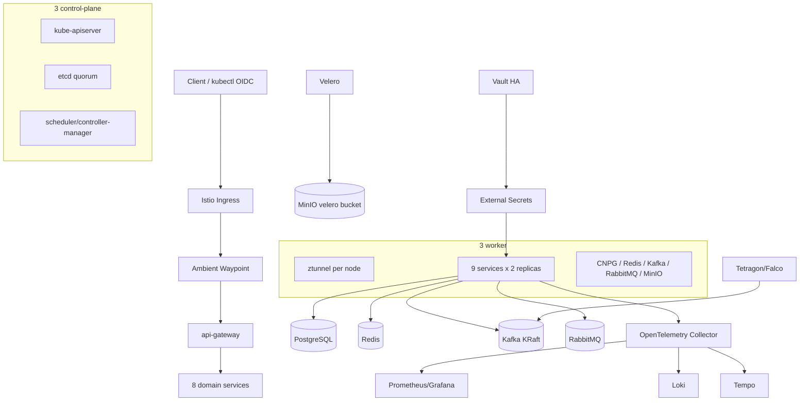

# Báo cáo thiết kế, triển khai và vận hành nền tảng AIMS trên Kubernetes

**Đơn vị học phần:** HUST – ISD.20252-18  
**Dự án:** AIMS (An Internet Media Store)  
**Môi trường:** `production` trên cụm kubeadm on-premise  
**Ngày chốt báo cáo:** 03/08/2026 (UTC+7)
**Thư mục mã nguồn:** `Programming/k8s/`  

> Báo cáo không chứa mật khẩu, Vault token, private key hoặc giá trị Secret. Mọi
> thông tin xác thực được lưu trong Vault/Kubernetes Secret và chỉ được nhắc tới
> bằng tên logical.

## 1. Tóm tắt kết quả

AIMS được triển khai theo mô hình production-like, gồm ba control-plane và ba
worker, container runtime là containerd. Tầng ứng dụng được tách thành chín
Argo Rollout, mỗi service có hai replica và cập nhật canary. Dữ liệu quan hệ đã
được chuyển từ PostgreSQL StatefulSet cũ sang CloudNativePG ba instance. Redis,
Kafka KRaft, RabbitMQ, MinIO và OpenSearch đều được operator quản lý.

Các lớp bảo mật chính đã được triển khai gồm Cilium NetworkPolicy, Istio
Ambient mTLS STRICT, Kyverno, Gatekeeper, seccomp, AppArmor, gVisor RuntimeClass,
Tetragon, Falco, Trivy Operator, Vault và External Secrets. Chuỗi cung ứng được
mô tả bằng GitLab CI với Trivy, Syft và Cosign keyless; GitOps dùng Argo CD và
progressive delivery dùng Argo Rollouts. Backup Velero chạy hằng ngày vào bucket
MinIO. Backup phục hồi cuối phiên `production-recovery-20260801-042048` đã hoàn
tất 1.360/1.360 item, 0 error và 8 warning; BackupStorageLocation ở trạng thái
`Available`.

Trong phiên nghiệm thu ngày 01/08/2026, cụm đã bị thay đổi topology so với phiên
triển khai ban đầu. Ba filesystem Longhorn bị lỗi metadata ext4, một Kafka volume
bị sai permission và kubelet probe plaintext bị mTLS STRICT từ chối. Trước khi
sửa, bốn Longhorn snapshot được tạo; sau đó filesystem được sửa offline bằng
`fsck`, thay mới chính xác drive MinIO không thể sửa, khôi phục permission Kafka,
và chuyển probe ứng dụng sang exec loopback. CNPG, Kafka và OpenSearch đã trở lại
đủ ba replica; MinIO báo `green` với 4/4 drive online.

## 2. Phạm vi và topology thực tế

Yêu cầu ban đầu mô tả cụm năm node, nhưng topology thực tế tại thời điểm chốt
báo cáo là sáu node. Đây là topology tốt hơn cho việc tách ba control-plane và
ba worker; report sử dụng trạng thái thực tế thay vì mô tả cũ.

| Node | IP | Vai trò | Kubernetes | Runtime |
|---|---:|---|---|---|
| `k8s-master.local` | `10.1.16.234` | control-plane | v1.34.10 | containerd 2.2.4 |
| `k8s-master2.local` | `10.1.16.235` | control-plane | v1.34.10 | containerd 2.2.2 |
| `k8s-master3.local` | `10.1.16.236` | control-plane | v1.34.10 | containerd 2.2.2 |
| `k8s-worker1.local` | `10.1.16.237` | worker | v1.34.10 | containerd 2.2.4 |
| `k8s-worker3.local` | `10.1.16.239` | worker | v1.34.10 | containerd 2.2.2 |
| `k8s-worker4.local` | `10.1.16.238` | worker | v1.34.10 | containerd 2.2.2 |

Tất cả node ở trạng thái `Ready`. Control-plane có taint `NoSchedule`; workload
nghiệp vụ chỉ chạy trên ba worker. Các operator hệ thống quan trọng được phép
chạy trên control-plane hoặc worker thông qua node affinity và toleration phù
hợp. Stateful workload ba replica sử dụng anti-affinity theo hostname.



## 3. Cơ sở lý thuyết của các công nghệ

### 3.1 Kubernetes, kubeadm và containerd

Kubernetes cung cấp control loop để đưa trạng thái thực tế về trạng thái khai
báo. Deployment/Rollout quản lý stateless pod; StatefulSet và operator quản lý
workload có định danh, volume và quy trình failover. `kubeadm` tạo cụm upstream,
không che giấu cấu hình control-plane, phù hợp cho học CKA/CKS và lab on-premise.

containerd thực thi container theo CRI. So với Docker Engine, containerd loại bỏ
lớp daemon không cần thiết trong Kubernetes, hỗ trợ OCI image, snapshotter và
nhiều runtime handler. RuntimeClass `sandbox` ánh xạ tới handler `runsc` để một
số pod chạy bằng gVisor.

### 3.2 Cilium, eBPF, NetworkPolicy và Hubble

Cilium thay kube-proxy/CNI truyền thống bằng eBPF datapath. eBPF cho phép áp
policy tại kernel với identity của workload thay vì chỉ dựa trên IP. Cilium hỗ
trợ Kubernetes NetworkPolicy và CiliumNetworkPolicy L3-L7. Hubble đọc flow từ
datapath để quan sát allow/deny, DNS và HTTP mà không cần chèn agent vào pod.

Policy `aims-zero-trust` chọn pod có nhãn `app.kubernetes.io/part-of=aims`, chỉ
cho phép các luồng nội bộ cần thiết, DNS, Keycloak, observability và egress web
80/443. Istio Ambient dùng HBONE cổng 15008, vì vậy policy có rule riêng cho
identity `host` và `remote-node`; nếu thiếu rule này, ztunnel sẽ bị Cilium chặn.

### 3.3 Istio Ambient, ztunnel, waypoint và mTLS

Ambient mode tách data plane thành:

- `ztunnel`: proxy L4 chạy một pod mỗi node, cung cấp mTLS, identity và tunnel
  HBONE mà không cần sidecar cho từng ứng dụng.
- `waypoint`: Envoy L7 theo namespace/service account, dùng khi cần HTTP routing,
  authorization và telemetry L7.

`PeerAuthentication production-strict` bắt buộc mTLS cho workload trong
namespace. STRICT không chấp nhận kubelet HTTP probe plaintext đi trực tiếp vào
cổng 8000. Probe của chart vì vậy chạy `python` trong container và gọi
`127.0.0.1`, vẫn kiểm tra đúng process nhưng không tạo lỗ hổng PERMISSIVE.

### 3.4 Pod Security, seccomp, AppArmor, capabilities và gVisor

Các cơ chế bổ sung cho nhau:

- Pod Security Admission `restricted` kiểm tra cấu hình pod ở admission time.
- seccomp lọc syscall. `security-telemetry-service` dùng Localhost profile
  `profiles/aims-runtime.json`; service khác dùng RuntimeDefault.
- AppArmor giới hạn file, execution, mount, ptrace, capability và network access.
- `capabilities.drop: [ALL]` loại capability Linux kế thừa không cần thiết.
- `allowPrivilegeEscalation: false`, `runAsNonRoot: true` và UID/GID 10001 giảm
  khả năng escape/lateral movement.
- gVisor chèn user-space kernel (`runsc`) giữa ứng dụng và host kernel. Payment
  và notification chạy bằng RuntimeClass `sandbox` vì đây là hai luồng xử lý dữ
  liệu nhạy cảm và message không tin cậy.

gVisor tăng isolation nhưng có overhead syscall/I/O, do đó không áp dụng đại trà
cho database hoặc Kafka.

### 3.5 CloudNativePG và Redis Operator

CloudNativePG quản lý PostgreSQL theo primary/replica, streaming replication,
failover, TLS và lifecycle. Ba instance được trải trên ba worker, lưu block
volume Longhorn. Service `-rw` luôn trỏ tới primary; ứng dụng không cần biết
primary đang ở node nào.

Redis được triển khai dưới dạng RedisReplication ba node và Sentinel ba node.
Redis giữ cache/session/cart tạm thời; Sentinel cung cấp discovery/failover.
Redis không thay PostgreSQL cho dữ liệu giao dịch bền vững.

### 3.6 Kafka KRaft và RabbitMQ

Kafka là distributed append-only log. KRaft lưu metadata bằng quorum controller
Kafka, loại bỏ ZooKeeper. Cluster có ba dual-role broker/controller, replication
factor 3 và `min.insync.replicas=2`. Hai topic chính:

- `aims-business-events`: event nghiệp vụ, retention 7 ngày.
- `aims-security-telemetry`: audit/runtime event, retention 14 ngày.

RabbitMQ là task queue, phù hợp công việc cần ack, retry và dead-letter. Queue
`payment.tasks` và `notification.tasks` có DLX/routing key lỗi. Kafka không thay
RabbitMQ trong use case này: Kafka tối ưu replay/event log, RabbitMQ tối ưu giao
việc và xác nhận xử lý.

### 3.7 Longhorn và MinIO

Longhorn là distributed block storage dùng replica trên các disk worker, hỗ trợ
snapshot, rebuild và CSI. PostgreSQL, Kafka, RabbitMQ, Redis, Loki, Tempo và
OpenSearch dùng PVC Longhorn.

MinIO cung cấp S3-compatible object storage. Dữ liệu object được erasure-code
trên nhiều volume, phù hợp artifact, backup và object ứng dụng. Bucket `velero`
nhận backup từ Velero; credential được lấy từ Vault qua External Secrets.

### 3.8 Vault, External Secrets và cert-manager

Vault là nguồn sự thật cho secret/PKI; triển khai HA Raft ba pod. Kubernetes auth
cho phép External Secrets Operator lấy đúng path theo role thay vì phân phối
Vault root token. `ClusterSecretStore/vault` ánh xạ KV v2 `aims/production` thành
Secret ngắn hạn trong từng namespace.

cert-manager tự động hóa certificate request/renewal từ Issuer/ClusterIssuer.
Secret TLS không được hard-code trong Git. Trong production thật cần thay demo
certificate OpenSearch và mọi HTTP endpoint bằng certificate do CA tin cậy cấp.

### 3.9 Keycloak và OIDC

Keycloak là Identity Provider theo OpenID Connect/OAuth 2.0. Ứng dụng dùng
authorization-code flow/PKCE hoặc confidential client; Kubernetes API server có
thể xác minh ID token qua `--oidc-issuer-url`, client ID và claim nhóm.

Triển khai hiện có Keycloak 26.5.5. Để kubectl OIDC hoàn chỉnh cần issuer HTTPS
ổn định, CA được cả máy người dùng và kube-apiserver tin cậy, realm/client/role,
RBAC binding và cập nhật static pod kube-apiserver lần lượt trên ba control-plane.
Không được dùng endpoint HTTP hoặc certificate demo cho luồng này.

### 3.10 Kyverno và OPA Gatekeeper

Kyverno viết policy bằng YAML, dễ đưa vào pipeline Kubernetes. Policy production
Enforce chặn privileged, host namespace, privilege escalation, capability không
drop-all, image `latest`; policy `production-runtime-hardening` Enforce thêm
non-root, seccomp và root filesystem chỉ đọc cho AIMS web workload.

Gatekeeper dùng Rego, phù hợp học CKS và các rule logic tổng quát. Constraint
`K8sRequiredRuntimeHardening` đã chuyển từ `dryrun` sang `deny` sau khi audit trả
0 violation. Hai engine cùng kiểm tra có chủ đích để luyện cả YAML policy và Rego.

### 3.11 Supply chain: Trivy, kubesec, Syft, SLSA, Cosign và Rekor

- Trivy quét CVE, misconfiguration và secret.
- kubesec chấm manifest Pod đã render từ Helm và chặn security score âm.
- Syft tạo SBOM CycloneDX để biết chính xác thành phần trong image.
- Cosign keyless dùng OIDC identity của GitLab CI để ký image/attestation, không
  lưu private key dài hạn.
- Rekor transparency log lưu bằng chứng chữ ký theo kiểu append-only.
- SLSA provenance v1 ghi build type, source commit, builder, pipeline run và
  digest của SBOM; Cosign đóng gói predicate trong in-toto Statement/DSSE.

Pipeline chỉ promote image nếu test, build, Trivy/kubesec, SBOM, sign, hai
attestation và tự verify đều thành công. `ClusterPolicy/
aims-verify-signed-slsa-images` nối Cosign với admission Kyverno: chỉ identity
GitLab đúng project mới hợp lệ, image bắt buộc tham chiếu digest, đồng thời phải
có SLSA v1 và CycloneDX attestation. Policy dùng `Audit` trong giai đoạn image
lab local với `mutateDigest=false`, `verifyDigest=true`; sau lần promote registry
đầu tiên thành công thì chuyển `Enforce` và bật `mutateDigest=true`.

Theo SLSA v1.2, provenance tồn tại đáp ứng hướng Build L1. Không tuyên bố Build
L2/L3 chỉ vì predicate đã ký: L2 còn yêu cầu provenance do control plane của
hosted build platform sinh độc lập với tenant; L3 cần hardened build platform.

### 3.12 GitLab CI, Argo CD và Argo Rollouts

GitLab CI làm CI: test, build, scan, SBOM, ký và cập nhật Git. Argo CD làm CD:
pull desired state từ Git, self-heal và prune. Mô hình pull tránh cấp credential
cluster cho runner. Argo Rollouts thay Deployment để chia traffic theo bước
20% → 50% → 100%, có pause 30 giây và `maxUnavailable=0`.

### 3.13 Observability

- Prometheus lưu metrics time-series; Grafana hiển thị dashboard/alert.
- Loki lưu log theo label và index nhẹ.
- OpenTelemetry chuẩn hóa trace, metric và log; Collector nhận OTLP.
- Tempo lưu distributed trace.
- OpenSearch giữ security/audit event cần truy vấn và phân tích dài hạn.

Luồng khuyến nghị: ứng dụng gửi OTLP → Collector → Prometheus/Loki/Tempo;
Tetragon/Falco/audit gửi security event → Kafka → security telemetry service →
OpenSearch.

### 3.14 Runtime security và backup

Tetragon quan sát syscall/process/network bằng eBPF và có thể enforce ở kernel.
Falco dùng rules để cảnh báo hành vi runtime, đồng thời phù hợp bài lab CKS.
Hai công cụ chạy song song với mục tiêu khác nhau, không coi log Falco là nguồn
thay thế hoàn toàn cho Tetragon.

Velero backup Kubernetes object và filesystem PVC qua node-agent, lưu vào MinIO.
Longhorn snapshot nhanh cho rollback volume; Velero bảo vệ metadata/cross-cluster
restore. Một chiến lược DR đúng cần cả hai và phải kiểm thử restore định kỳ.

## 4. Kiến trúc ứng dụng AIMS

| Service | Trách nhiệm | State/queue chính | Runtime |
|---|---|---|---|
| `api-gateway` | entry point API, routing tổng | Redis | runc |
| `auth-service` | đăng nhập, token/profile | PostgreSQL, Keycloak | runc |
| `catalog-service` | media/product catalog | PostgreSQL, Redis | runc |
| `cart-service` | giỏ hàng | Redis, PostgreSQL | runc |
| `order-service` | order lifecycle | PostgreSQL, Kafka | runc |
| `payment-service` | payment orchestration | RabbitMQ, PostgreSQL | gVisor |
| `inventory-service` | tồn kho/reservation | PostgreSQL, Kafka | runc |
| `notification-service` | email/webhook task | RabbitMQ + DLQ | gVisor |
| `security-telemetry-service` | runtime/audit/ML feature | Kafka, OpenSearch | Localhost seccomp + AppArmor |

Mỗi service hiện là một process/deployment độc lập nhưng cùng dùng image Django
`aims-backend:prod-sim`. Đây là bước tách deployment boundary, chưa phải tách
codebase/database schema hoàn toàn. Production thật cần image/digest, API contract
và ownership database riêng cho từng service.

## 5. Cấu trúc mã triển khai

```text
Programming/
├── .gitlab-ci.yml
├── backend/Dockerfile
├── frontend/Dockerfile
└── k8s/
    ├── aims-chart/
    │   ├── Chart.yaml
    │   ├── values.yaml
    │   └── templates/{services,frontend,routing}.yaml
    ├── cks-lab/{README.md,00-lab-guardrails.yaml}
    ├── node-profiles/
    │   ├── aims-runtime.json
    │   └── aims-restricted.apparmor
    ├── platform/
    │   ├── 00-namespace.yaml
    │   ├── 00-foundation.yaml
    │   ├── 10-data-messaging.yaml
    │   ├── 15-external-secrets.yaml
    │   ├── 20-policy-security.yaml
    │   ├── 21-gatekeeper-constraint.yaml
    │   ├── 22-supply-chain-policy.yaml
    │   ├── 25-kube-bench.yaml
    │   ├── 30-observability.yaml
    │   ├── 40-production-enforcement.yaml
    │   ├── 50-backup.yaml
    │   ├── 60-backup-schedule.yaml
    │   └── *-values.yaml
    └── scripts/
        ├── configure-gvisor-worker.sh
        ├── configure-small-disk-worker.sh
        ├── install-node-security-profiles.sh
        ├── cleanup-production-legacy.sh
        ├── verify-aims.sh
        ├── verify-cks-lab.sh
        ├── velero-config-restore-drill.sh
        └── velero-smoke-backup.sh
```

## 6. Quy trình triển khai thực tế

### 6.1 Chuẩn bị node

Các node tắt swap, bật forwarding/bridge netfilter, cài kubelet/kubeadm/kubectl
cùng minor version và dùng containerd với systemd cgroup. Control-plane join bằng
certificate key; worker join bằng bootstrap token. Sau join:

```bash
kubectl get nodes -o wide
kubectl wait --for=condition=Ready nodes --all --timeout=5m
```

Worker chạy sandbox được cài `runsc`, thêm runtime handler containerd và label:

```bash
sudo Programming/k8s/scripts/configure-gvisor-worker.sh
kubectl label node <worker> runtime.gvisor.dev/enabled=true --overwrite
```

Seccomp/AppArmor Localhost phải tồn tại trên mọi node có thể nhận telemetry pod:

```bash
sudo Programming/k8s/scripts/install-node-security-profiles.sh \
  Programming/k8s/node-profiles/aims-runtime.json \
  Programming/k8s/node-profiles/aims-restricted.apparmor
```

### 6.2 Network và service mesh

Cilium 1.19.6 được cài làm CNI; Hubble bật để quan sát flow. Istio 1.29.2 được
cài với base, istiod, CNI, ztunnel và ingress gateway. Namespace production:

```bash
kubectl label ns production istio.io/dataplane-mode=ambient --overwrite
kubectl apply -f Programming/k8s/platform/00-foundation.yaml
```

Foundation tạo RuntimeClass, mTLS STRICT, waypoint, quota, LimitRange và rule
HBONE/host probe. Operator namespace liên quan được label Ambient để traffic tới
data pod không bị STRICT từ chối.

### 6.3 Secret và PKI

Vault HA Raft được initialize/unseal một lần. Kubernetes auth role chỉ cho phép
ESO đọc path AIMS. Sau khi đưa secret vào `aims/production`:

```bash
kubectl apply -f Programming/k8s/platform/15-external-secrets.yaml
kubectl get clustersecretstore vault
kubectl get externalsecret -A
```

Các key logical gồm `DATABASE_URL`, `DJANGO_SECRET_KEY`, Redis/RabbitMQ/MinIO,
Keycloak client secret và OpenSearch admin password. Không lấy secret từ Git.

### 6.4 Data và messaging

```bash
kubectl apply --server-side --force-conflicts \
  -f Programming/k8s/platform/10-data-messaging.yaml
```

Manifest tạo CNPG 3 instance, Redis replication/Sentinel, MinIO tenant, Kafka
KRaft node pool, topic/user ACL, RabbitMQ cluster và durable queue có DLQ.

Migration PostgreSQL đã thực hiện trong maintenance window:

1. Scale 9 Rollout và backend cũ về 0.
2. Tạo `pg_dump` tại
   `/home/dat/aims-deploy-20260729/backups/pre-cnpg-cutover-20260729.dump`.
3. Restore bằng `pg_restore --role=aims` vào CNPG.
4. So sánh 97 table và 30 Django migration.
5. Cập nhật `DATABASE_URL` trong Vault rồi chờ ESO sync.
6. Scale 9 Rollout lên 2 và kiểm tra health/database query.

PostgreSQL cũ được giữ tạm ở replica 0 để rollback; PVC không bị xóa.

### 6.5 Policy và runtime security

Gatekeeper ConstraintTemplate phải được apply trước Constraint để CRD generated
kịp được tạo:

```bash
kubectl apply --server-side -f Programming/k8s/platform/20-policy-security.yaml
kubectl wait --for=condition=Established \
  crd/k8srequiredruntimehardenings.constraints.gatekeeper.sh --timeout=2m
kubectl apply -f Programming/k8s/platform/21-gatekeeper-constraint.yaml
```

Tetragon policy theo dõi mở file nhạy cảm và `execve`. Kyverno mutation bổ sung
RuntimeDefault seccomp cho waypoint do pod được Istio controller sinh tự động.

### 6.6 Ứng dụng và canary

```bash
helm upgrade --install aims Programming/k8s/aims-chart \
  --namespace production --history-max 5
kubectl get rollout -n production -w
```

Pod có aggregate topology spread theo hostname và preferred anti-affinity theo
tên service. `maxSurge=1` cho phép một pod canary thứ ba tạm thời; quota CPU limit
50 core bao gồm phần surge của chín Rollout chạy đồng thời.

### 6.7 Observability và security search

```bash
kubectl apply -f Programming/k8s/platform/30-observability.yaml
helm upgrade --install loki grafana/loki -n observability \
  -f Programming/k8s/platform/loki-values.yaml
helm upgrade --install tempo grafana/tempo -n observability \
  -f Programming/k8s/platform/tempo-values.yaml
helm upgrade --install opensearch opensearch/opensearch -n opensearch \
  -f Programming/k8s/platform/opensearch-values.yaml
```

OpenTelemetry Collector dùng image contrib vì exporter Prometheus không có trong
core image. OpenSearch hard anti-affinity đảm bảo ba replica không cùng node.

### 6.8 Velero và MinIO

```bash
kubectl apply -f Programming/k8s/platform/50-backup.yaml
helm upgrade --install velero vmware-tanzu/velero -n velero \
  -f Programming/k8s/platform/velero-values.yaml
kubectl apply -f Programming/k8s/platform/60-backup-schedule.yaml
Programming/k8s/scripts/velero-smoke-backup.sh
```

Schedule chạy `0 2 * * *` UTC. Backup smoke
`production-smoke-20260729101828` hoàn tất 4.069 item, không error/warning. Các
daily backup ngày 30/07, 31/07 và 01/08 được giữ làm bằng chứng sự cố nhưng có
phase `Failed` do MinIO từng lỗi filesystem/trả 503. Sau recovery, backup
`production-recovery-20260801-042048` hoàn tất 1.360/1.360 item, 0 error, 8
warning; BSL `default=Available`. Một backup trùng còn ở hàng đợi đã được xóa
trước khi chạy, không xóa bản backup dữ liệu nào đã hoàn tất.

Sau khi hoàn thành Gateway/audit/policy/Trivy và cleanup, backup nghiệm thu
`production-post-cks-20260801` hoàn tất 1.102/1.102 item, 0 error, 6 warning;
đây là recovery point mới nhất của namespace `production`.

Restore drill metadata `aims-config-drill-20260801113325` đã phục hồi đúng 11
ConfigMap từ recovery point trên sang namespace cô lập `production-drill`.
Kết quả xác minh: 0 Pod, 0 Secret, 0 PVC, 0 controller; phase `Completed`, 0
error và namespace tạm đã được xóa. Restore CR được giữ lại trong namespace
`velero` làm audit evidence.

## 7. Phiên bản thành phần đã ghi nhận

| Thành phần | Chart/app version |
|---|---|
| Cilium | 1.19.6 |
| Istio | 1.29.2 |
| Argo CD | chart 10.2.1 / app 3.4.5 |
| Argo Rollouts | chart 2.41.1 / app 1.9.1 |
| CloudNativePG | chart 0.29.0 / app 1.30.0 |
| Strimzi | 1.1.0; Kafka 4.3.0 |
| Redis Operator | 0.25.0 |
| MinIO Operator | 7.1.1 |
| Longhorn | 1.12.0 |
| Vault | chart 0.34.0 / app 2.0.3 |
| External Secrets | chart/app 2.8.0 |
| Kyverno | chart 3.8.2 / app 1.18.2 |
| Gatekeeper | 3.23.0 |
| Falco | chart 9.1.0 / app 0.44.1 |
| Tetragon | 1.6.1 |
| Trivy Operator | chart 0.34.0 / app 0.32.0 |
| Prometheus stack | chart 87.16.1 |
| OpenTelemetry Operator | chart 0.120.0 / collector 0.156.0 |
| Loki | chart 7.1.0 / app 3.6.8 |
| Tempo | chart 1.24.4 / app 2.9.0 |
| OpenSearch | 3.7.0 |
| Velero | chart 12.1.0 / app 1.18.1 |
| Keycloak | chart 7.1.9 / app 26.5.5 |

## 8. Sự cố, nguyên nhân và cách khắc phục

### 8.1 DiskPressure và mở rộng toàn bộ node

Kubelet mặc định eviction khi imagefs còn dưới 15%, khiến partition root 40 GiB
bị taint dù còn khoảng 5–6 GiB. Trong lúc recovery, hard reserve được hạ tạm về
5%; các bản backup etcd tạm do `kubeadm` để lại được xóa sau khi xác minh đúng
đường dẫn, cache/journal/image không dùng cũng được dọn.

Kiểm tra `lsblk` sau đó cho thấy disk `/dev/sda` của cả sáu VM đã được
hypervisor cấp 300 GiB nhưng một số partition `/dev/sda2`, đặc biệt ba
control-plane, vẫn chỉ 40 GiB. Partition được mở rộng online bằng `growpart`,
filesystem ext4 được mở rộng bằng `resize2fs`; cả sáu root filesystem hiện
khoảng 295 GiB usable. Tại lúc nghiệm thu, control-plane dùng 9–12%, worker dùng
13–20%. Eviction reserve được trả về 10% bằng
`AIMS_EVICTION_PERCENT=10 configure-small-disk-worker.sh`. Kết quả là
`DiskPressure=False` trên cả sáu node.

### 8.2 CNPG failover

Khi primary bị evict, CNPG chuyển primary sang instance 2; application tiếp tục
qua `-rw` service. Volume replica cũ có lỗi ext4; không tiếp tục ép `fsck` khi
phát hiện multiply-claimed block. Chỉ pod/PVC replica hỏng được xóa, sau đó CNPG
thực hiện base backup từ primary khỏe. Lần bootstrap đầu bị `DiskPressure` ngắt
giữa chừng; sau khi dọn disk, replica được tạo lại với PVC mới và cluster trở về
`3/3 – Cluster in healthy state`. Primary và hai volume khỏe không bị xóa.

### 8.3 Filesystem Longhorn sau thay đổi topology

Ba volume báo `fsck found errors but could not correct them`. Quy trình recovery:

1. Xác minh volume attached nhưng chưa mount bằng `findmnt`.
2. Tạo snapshot `pre-recovery-20260801-{pg,minio,os}` và chờ `readyToUse=true`.
3. Chạy `fsck.ext4 -fn` để đánh giá.
4. Chạy `fsck.ext4 -fy` trên đúng `/dev/longhorn/<volume>` khi filesystem còn
   khả năng sửa an toàn.
5. Với drive MinIO bị hỏng metadata `.minio.sys` không thể sửa, dừng đúng pod và
   kubelet liên quan, xác nhận unmount, format lại duy nhất block device hỏng rồi
   để MinIO erasure coding tái đồng bộ từ ba drive còn lại.
6. Để CSI mount lại và kiểm tra operator readiness.

Không chạy fsck trên filesystem đang mount. Snapshot phải được tạo trước vì
`fsck -y` thay đổi metadata và có thể đưa inode hỏng vào `lost+found`. Kết quả:
OpenSearch `3/3`, CNPG `3/3`, MinIO `green` và 4/4 drive online.

### 8.4 Kafka AccessDenied

Broker 2 không thể tạo `kafka-log2` do root volume mode 0755 trong khi process là
UID 1001, GID 0. Snapshot Kafka được tạo trước; mount root được khôi phục mode
2775, giữ owner root:root để group 0 có quyền ghi/setgid. Broker sau đó join lại
KRaft quorum. Khi operator rolling để áp anti-affinity, broker 1 lộ thêm lỗi
filesystem ext4 do chuỗi eviction trước đó. Snapshot
`pre-fsck-kafka-broker1-20260801` được tạo; volume được kiểm tra/sửa offline và
broker replica được dựng lại từ hai ISR còn khỏe trên PVC sạch. Desired state
được bổ sung `fsGroup: 0`, `fsGroupChangePolicy: Always` để kubelet phục hồi
group-write khi Longhorn volume chuyển node. Cuối phiên Kafka CR `Ready=True`,
hai KafkaTopic Ready và ba broker phân bố worker4/worker3/worker1 theo tỷ lệ
1/1/1.

### 8.5 Probe bị mTLS STRICT chặn

Log ztunnel ghi `explicitly denied by istio_converted_static_strict` cho kubelet
HTTP probe. Không chuyển PeerAuthentication sang PERMISSIVE. Chart được đổi sang
exec loopback probe, loại bỏ plaintext node-to-pod traffic nhưng vẫn giữ liveness
và readiness.

### 8.6 Cilium chặn HBONE của Strimzi

NetworkPolicy do Strimzi tạo chỉ cho port broker/operator và vô tình chặn 15008.
Rule `allow-ambient-hbone` được thêm cho Kafka pod; Cilium policy của AIMS cũng
cho host/remote-node HBONE. Sau sửa, operator và broker giao tiếp qua Ambient.

### 8.7 Gatekeeper audit OOMKilled

Admission controller vẫn phục vụ nhưng audit controller lặp `OOMKilled` vì
quét toàn cụm nhiều operator mỗi 60 giây với limit 512 MiB. Helm values mới đặt
audit interval 300 giây, chunk 250, request 512 MiB và limit 2 GiB; nodeSelector
và toleration hệ thống được giữ nguyên. Sau Helm upgrade, cả audit deployment và
hai admission replica Ready; ConstraintTemplate `created=true`.

### 8.8 Trivy scan Job lỗi cache lock

Trivy Operator ở chế độ Standalone tạo một container scan cho mỗi container của
workload nhưng các container dùng chung cache. Với workload đa-container, Trivy
0.72 báo `Failed to acquire cache or database lock`; Job chuyển `Error` rồi bị
operator tạo lại. Release được chuyển sang ClientServer: `trivy-server-0` giữ
DB/cache tập trung, scan Job gọi server, concurrent Job giới hạn 1, timeout 10
phút và TTL sau hoàn tất 30 giây. Scan đa-container sau sửa hoàn tất `1/1`, log
operator không còn lỗi lock. Docker Hub sau đó trả rate-limit khi quét Velero;
mapping `index.docker.io: mirror.gcr.io` được thêm đúng dạng scalar trong Helm
values. Các scan kế tiếp hoàn tất trong 6–13 giây và số pod
`Failed/Unknown/Error` trở về 0; 125 VulnerabilityReport, 352 ConfigAuditReport
và 138 SBOMReport đã tồn tại. Pod
`scan-vulnerabilityreport-7c979ff444-ghcct` được kiểm tra riêng: pod đã được
scheduler gán vào worker1, quét xong image `kube-controller-manager:v1.34.10`,
tạo VulnerabilityReport lúc 09:39:34Z (1 Critical, 5 High, 3 Medium) rồi được
TTL controller xóa đúng cấu hình 30 giây. Vì vậy trạng thái Pending nhìn thấy
trước đó chỉ là giai đoạn chờ ngắn, không phải scan bị treo; verifier chỉ báo
lỗi nếu Pending quá 2 phút. Hai image mô phỏng chỉ có trong containerd node
(`aims-backend:prod-sim`, `aims-frontend:prod-sim`) được exclude khỏi scanner
in-cluster; pipeline GitLab vẫn bắt buộc Trivy/Syft trước khi push bản registry.

## 9. Kiểm thử và tiêu chí nghiệm thu

Nghiệm thu tự động cuối phiên bằng `Programming/k8s/scripts/verify-aims.sh` trả
exit code 0. Trạng thái ghi nhận lúc 17:23 ngày 01/08/2026 (UTC+7):

| Tiêu chí | Kết quả |
|---|---|
| Node Ready, không DiskPressure | 6/6, PASS |
| Argo Rollout khỏe | 9/9, PASS |
| Pod microservice sẵn sàng | 18/18, PASS |
| Frontend Helm | 2/2, non-root, read-only rootfs |
| Phân bố microservice | worker1/worker3/worker4 = 6/6/6 |
| CloudNativePG | 3/3, healthy |
| Kafka KRaft | Ready, 2 topic Ready, broker trải 3 worker |
| RabbitMQ | all replicas ready |
| MinIO / OpenSearch | green 4/4 drive / 3 replica |
| Vault SecretStore / Velero BSL | Valid / Available |
| PSA / Gatekeeper | Restricted Enforce / constraint `deny` |
| gVisor / Localhost profiles | 4 sandbox pod / 2 telemetry pod |
| Capabilities | 18/18 container drop `ALL` |
| Gateway API ingress | HTTP 31088 + HTTPS 32725, certificate Ready, HTTPS 200 |
| Kyverno Cosign/SLSA | Ready=True |
| kube-bench | 3 control-plane + 3 worker pod Running |
| Pod/Controller lỗi | 0 bad pod, 0 controller thiếu replica |
| Trivy | operator/server Running, 0 Job fail, 0 Pending >2 phút |
| Backup production mới nhất | `production-post-cks-20260801`, Completed 1.102/1.102, 0 error, 6 warning |
| Restore drill cô lập | `aims-config-drill-20260801113325`, Completed, 11 ConfigMap, không workload/Secret/PVC |
| Policy report fail | 0; đã dọn 2 ReplicaSet Strimzi scale 0 và Job migration lịch sử |
| External Sentinel validation | 4 controller đo tải Running/Ready đang deletion-lock; được tách khỏi desired-state và không tính là AIMS legacy |

### 9.1 Lệnh kiểm tra nhanh

```bash
kubectl get nodes
kubectl -n production get rollout
kubectl -n production get cluster.postgresql.cnpg.io aims-postgres-cnpg
kubectl -n production get kafka.kafka.strimzi.io aims-kafka
kubectl -n production get rabbitmqcluster aims-rabbitmq
kubectl -n production get tenant aims-minio
kubectl -n opensearch get sts aims-security-master
kubectl -n velero get backupstoragelocation,backup,schedule
kubectl -n kube-system get ds cilium,tetragon
kubectl -n falco get ds falco
```

### 9.2 Security assertions

```bash
# mTLS STRICT
kubectl -n production get peerauthentication production-strict -o yaml

# gVisor
kubectl -n production get pod -l app.kubernetes.io/name=payment-service \
  -o jsonpath='{range .items[*]}{.metadata.name}{" runtime="}{.spec.runtimeClassName}{"\n"}{end}'

# Localhost seccomp/AppArmor
kubectl -n production get pod -l app.kubernetes.io/name=security-telemetry-service \
  -o jsonpath='{.items[0].spec.securityContext}'

# Capabilities
kubectl -n production get pod -l aims.hust.vn/workload-group=microservices \
  -o json | jq '[.items[].spec.containers[].securityContext.capabilities.drop] | unique'

# Policy
kubectl get clusterpolicy.kyverno.io
kubectl get k8srequiredruntimehardening production-runtime-hardening
kubectl -n production get ciliumnetworkpolicy aims-zero-trust
```

### 9.3 Backup và restore drill

Kiểm tra backup không đủ để chứng minh DR. Drill metadata an toàn đã được tự
động hóa:

```bash
Programming/k8s/scripts/velero-config-restore-drill.sh
kubectl -n velero get restores.velero.io \
  -l restore.aims.io/type=configmap-drill
```

Script từ chối namespace đích có sẵn hoặc namespace hệ thống; chỉ include
ConfigMap, tắt cluster resource/PV restore, áp PSA Restricted, xác minh không có
Pod/Secret/PVC/controller rồi cleanup namespace. Lần chạy nghiệm thu
`aims-config-drill-20260801113325` Completed với 11 ConfigMap và 0 object ngoài
scope. Đây chưa phải full data DR: vẫn cần một bài riêng kiểm tra PostgreSQL PITR,
Kafka topic/consumer state, volume checksum và khả năng khởi động ứng dụng.

## 10. Phân bố workload và tài nguyên

Ba-replica stateful cluster dùng anti-affinity theo
`kubernetes.io/hostname`. Microservice dùng topology spread và anti-affinity
preference. Request hiện tại mỗi service pod là 100m CPU/192 MiB; limit là
750m/768 MiB. ResourceQuota production:

- request CPU: 12 core;
- request memory: 24 GiB;
- limit CPU: 50 core, gồm canary surge;
- limit memory: 64 GiB;
- tối đa 30 PVC.

Kết quả thực tế: 18 microservice pod phân bố worker1/worker3/worker4 = 6/6/6;
CNPG và Kafka đều có đúng một replica trên mỗi worker. Worker1 đã có root 300
GiB và eviction reserve 10%, không còn ngoại lệ 5%.

Không đánh giá cân bằng chỉ bằng số pod: database và broker nặng hơn pod Django.
Nên theo dõi `kubectl top nodes`, CPU request, memory working set, IOPS và số
Longhorn replica. Descheduler chỉ nên dùng sau khi PDB/anti-affinity đã đúng.

## 11. CI/CD và GitOps

File `Programming/.gitlab-ci.yml` gồm sáu lớp logic trên bảy stage:

1. `test`: pytest, lint và typecheck.
2. `build`: Docker-in-Docker build/push backend và frontend.
3. `scan`: Trivy image/config, kubesec manifest và Syft CycloneDX SBOM.
4. `attest`: sinh SLSA v1 predicate; Cosign keyless ký image theo digest và
   attach CycloneDX + SLSA in-toto attestations; Rekor ghi transparency entry.
5. `verify`: Cosign kiểm tra lại signature và cả hai predicate theo issuer/SAN
   GitLab trước khi cho phép promote.
6. `gitops`: sửa Helm image thành immutable digest và push về nhánh mặc định.

`argocd-application.yaml` bật automated sync, prune, self-heal và server-side
apply, trỏ tới `https://github.com/tndat-dev/An-Internet-Media-Store.git`. Chỉ
apply sau khi nhánh `main` chứa đầy đủ chart. Pipeline có thể đặt masked
`GITOPS_PUSH_URL` để đẩy digest đã xác minh về repository GitOps này.

## 12. Giới hạn và công việc còn lại

Các điểm dưới đây là giới hạn thật, không được mô tả thành capability đã hoàn tất:

1. Chín service dùng chung image/codebase Django; chưa phải chín bounded context
   độc lập về source repository và database ownership.
2. GitLab pipeline và Argo CD manifest đã có trong code; GitHub là repository
   GitOps, còn GitLab vẫn cần project/mirror, runner, registry và masked
   `GITOPS_PUSH_URL` để chạy CI end-to-end.
3. Keycloak đang chạy nhưng kubectl OIDC chưa được bật trên ba kube-apiserver.
   Cần issuer HTTPS ổn định, CA trust, realm/client/group mapper và RBAC.
4. PSA namespace đã dùng `restricted:latest` Enforce. Namespace `cks-lab` tách
   riêng dùng Baseline Enforce + Restricted Audit/Warn cho negative test CKS.
5. OpenSearch chart còn dùng demo security configuration/certificate; admin
   password mạnh nằm trong Vault nhưng TLS cần chuyển sang cert-manager.
6. Worker1 đã mở rộng root disk lên 300 GiB và dùng eviction reserve 10%, nhưng
   Longhorn vẫn dùng chung physical/virtual disk với OS và containerd. Production
   nên tách riêng data disk để giảm failure domain và I/O contention.
7. Image `aims-backend:prod-sim` đang được nạp cục bộ lên worker để mô phỏng. CI
   thật phải push immutable digest vào registry mà mọi node truy cập được.
8. Rekor đang được dùng theo mặc định public Sigstore trong pipeline; chưa có
   private Rekor instance on-premise.
9. Backup recovery và restore drill ConfigMap cô lập đã hoàn tất; các daily
   backup trong thời gian storage hỏng vẫn `Failed`. Cần drill phục hồi dữ liệu
   stateful/off-cluster và phê duyệt RPO/RTO.
10. MinIO/OpenSearch/Longhorn sau recovery phải được theo dõi healing và scrub;
    snapshot trước recovery không thay thế backup ngoài cluster.

## 13. Khuyến nghị production

- Worker1 đã tăng lên 300 GiB; bước tiếp theo là tách disk hệ điều hành/containerd
  khỏi Longhorn data disk trên cả ba worker.
- Dùng registry nội bộ TLS, deploy theo digest và enforce Cosign signature.
- Duy trì PSA Restricted Enforce và kiểm tra operator compatibility trước mỗi
  lần nâng phiên bản.
- Hoàn thiện Keycloak HA với PostgreSQL ngoài, TLS cert-manager, realm-as-code và
  kube-apiserver OIDC rolling change.
- Thay OpenSearch demo certificate, cấu hình index lifecycle và snapshot S3.
- Thêm Kafka consumer lag, RabbitMQ queue depth/DLQ, CNPG replication lag,
  Longhorn replica health và SLO alert.
- Chạy chaos test từng node, broker, database primary và restore sang namespace
  drill trước demo/nghiệm thu cuối.

## 14. Bổ sung hardening và supply chain ngày 01/08/2026

### 14.1 Kiểm kê topology sau khi tăng tài nguyên

API thực tế trả về 6 node Ready, mỗi node 8 vCPU và xấp xỉ 64 GiB RAM. Cả sáu
VM có `/dev/sda` 300 GiB; `growpart /dev/sda 2` và `resize2fs /dev/sda2` đã mở
rộng online các partition còn nhỏ. Root filesystem hiện xấp xỉ 295 GiB/node;
ba control-plane dùng lần lượt khoảng 12%, 9%, 10%, ba worker khoảng 13%, 20%,
18%. Không node nào có DiskPressure. Topology hiện là 3 control-plane + 3 worker.

### 14.2 Gateway API và Ambient waypoint

Hai loại gateway có chức năng khác nhau và được khai báo tách biệt:

| Resource | GatewayClass | Namespace | Chức năng |
|---|---|---|---|
| `Gateway/aims-ingress` | `istio` | `istio-ingress` | north–south HTTP ingress do Istio Gateway controller quản lý |
| `Gateway/aims-waypoint` | `istio-waypoint` | `production` | east–west L7 proxy trong Ambient mesh |

`HTTPRoute/production/aims-web` attach cross-namespace vào listener `http` và
`https`; mỗi
prefix API trỏ đúng service, fallback `/api/` vào API Gateway và `/` vào
frontend. `allowedRoutes` chỉ nhận namespace `production`. VirtualService cũ bị
loại khỏi chart để tránh hai nguồn routing cùng tồn tại. Istio tự sinh
Deployment/Service `aims-ingress-istio`; HPA giữ 2–4 replica và PDB
`minAvailable=1`. Cụm đang dùng Gateway API CRD chưa hỗ trợ
`spec.infrastructure`, nên customization mới hơn qua `parametersRef` không được
đưa vào desired state. Annotation `networking.istio.io/service-type: NodePort`
được dùng vì kubeadm bare metal không có cloud LoadBalancer; Gateway đã
`Programmed=True`. Service mở HTTP NodePort 31088 và HTTPS NodePort 32725;
cert-manager cấp certificate self-signed cho `aims.lab`, smoke test TLS trả 200.

### 14.3 RBAC

- `aims-developers` và `aims-observers` chỉ get/list/watch pod, log, service,
  rollout, route, event và PVC; không đọc Secret.
- `aims-operators` bind `admin` nhưng chỉ trong namespace `production`, không
  nhận `cluster-admin`.
- `aims-cicd-deployer` chỉ mutate stateless application/routing/PDB/config; không
  delete và không có quyền Secret hay data operator.
- chín ServiceAccount ứng dụng có `automountServiceAccountToken: false`, vì ứng
  dụng không cần gọi Kubernetes API.

### 14.4 kube-bench và audit logging

Hai DaemonSet kube-bench v0.15.5 bao phủ đúng failure domain: một pod trên từng
control-plane chạy target `master,etcd,node,policies`, một pod trên từng worker
chạy `node,policies`. Host mount chỉ read-only, capability drop ALL, seccomp
RuntimeDefault, request 20m CPU/64 MiB; benchmark lặp hằng tuần và ghi JSON ra
stdout để Loki thu thập.

Benchmark được ghim `--version 1.34`, ánh xạ CIS 1.12 thay vì fallback sai về
Kubernetes 1.18. Sau hardening `--profiling=false`, short-lived bound SA token,
permission 0600 cho kubelet config/unit/drop-in và mode 0700 cho etcd data:

- ba worker: 19 PASS, 0 FAIL, 40 WARN/node;
- ba control-plane: 73 PASS, 2 FAIL, 51 WARN/node;
- hai FAIL control-plane được chấp nhận có tài liệu: kubeadm static etcd chạy
  root nên data owner là `root:root`; kubelet serving certificate dùng
  node-local CA nên không ép `--kubelet-certificate-authority` về cluster CA.

Các WARN chủ yếu là kiểm tra manual/policy review, không đồng nghĩa pod lỗi.

Audit policy ưu tiên bằng chứng nhưng tránh lộ bí mật:

- Secret luôn chỉ `Metadata`, không log request/response body;
- thay đổi RBAC/admission/policy dùng `RequestResponse`;
- mutation trong `production` và hạ tầng cluster dùng `Request`;
- health/ready/metrics, event và watch kube-proxy bị loại để giảm nhiễu;
- catch-all `Metadata`, bỏ stage `RequestReceived` và managedFields.

Mỗi kube-apiserver ghi JSON tại `/var/log/kubernetes/audit/audit.log`, rotate
100 MiB, giữ 10 file/tối đa 30 ngày. Script triển khai rolling từng control-plane,
tạo backup static manifest và chờ `/readyz` trước node tiếp theo.

### 14.5 Dọn pod lỗi

Kiểm kê phát hiện controller đều đủ replica; phần lớn dòng lỗi là pod ReplicaSet
lịch sử `Failed/Completed` sau reboot, không phải workload hiện tại. Script
`cleanup-stale-pods.sh` chỉ xóa pod lịch sử có owner ReplicaSet, giữ Job pod làm
bằng chứng, xóa Kafka diagnostic pod, và với `--prune-known-tests` loại các
deployment test không thuộc desired state (`default/postgres`, production
loadgen/nginx/redis test) cùng Bookinfo route 100 ngày tuổi. PVC/data operator
không bị đụng tới. Lần chạy thực tế đã xóa 115 pod ReplicaSet lịch sử; truy vấn
sau cleanup trả 0 pod `Failed/ContainerStatusUnknown`, trong khi mọi
Deployment/StatefulSet/DaemonSet vẫn đủ desired replica.

### 14.6 Tài liệu chuẩn tham chiếu

- SLSA specification v1.2 và Build provenance v1: `https://slsa.dev/spec/v1.2/`;
- GitLab SLSA và runner-generated provenance: `https://docs.gitlab.com/ci/pipeline_security/slsa/`;
- GitLab/Sigstore keyless identity: `https://docs.gitlab.com/ci/yaml/signing_examples/`;
- Cosign sign/attest/verify: `https://docs.sigstore.dev/cosign/`;
- Kyverno verifyImages/Sigstore: `https://kyverno.io/docs/policy-types/cluster-policy/verify-images/sigstore/`;
- Kubernetes audit: `https://kubernetes.io/docs/tasks/debug/debug-cluster/audit/`;
- kube-bench: `https://github.com/aquasecurity/kube-bench`.

### 14.7 Trạng thái reconcile live của lần cập nhật này

Desired state đã được server-side dry-run rồi apply từ snapshot
`/home/dat/aims-deploy-20260729`. RBAC, Kyverno Cosign/SLSA policy, hai
kube-bench DaemonSet và Helm revision 11/chart v0.3.0 của AIMS đều hoạt động.
Frontend cũ được Helm adopt, hai replica chạy trên worker3/worker4 với non-root,
seccomp và read-only rootfs. Audit được thay
rolling trên `.234`, `.235`, `.236`; mỗi API server quay lại Ready trước khi
chuyển node và đều sinh JSON audit log. Một lỗi runbook được phát hiện khi bản
backup manifest nằm trong thư mục static Pod; script đã đổi nơi backup sang
`/var/backups/kubernetes`, tránh kubelet đọc hai manifest trùng tên.

`verify-aims.sh` trả exit 0 với toàn bộ assertion PASS: 6 node, 9 Rollout,
18 microservice pod, placement 6/6/6, stateful service, Gateway, RBAC, Kyverno,
kube-bench, backup và không còn stale ReplicaSet pod. Code local và snapshot
trên master được đối chiếu checksum sau lần đồng bộ cuối.

### 14.8 Production-like và thực hành CKS

Phạm vi được chốt là mô phỏng production, không tuyên bố enterprise production.
Các control có bằng chứng live gồm PSA Restricted Enforce, Kyverno Enforce,
Gatekeeper deny, RBAC negative test, Cilium policy, Ambient mTLS STRICT, TLS
Gateway, kube-bench, gVisor, seccomp/AppArmor, Trivy, Tetragon, Falco và audit
logging. `cks-lab` chứa guardrail riêng; `verify-cks-lab.sh` chạy ba server
dry-run độc lập: PSA chặn privileged, Kyverno chặn rootfs ghi được và Gatekeeper
chặn privilege escalation/capability. Không test nào tạo pod thật.

Cleanup cuối đã loại đúng các controller monolith/loadgen/sentinel cũ khỏi
`production`, giữ nguyên PVC. Hai verifier trả exit 0, HTTPS trả 200, bad pod =
0, controller thiếu replica = 0 và 18 microservice pod được cân 6/6/6.

### 14.9 Sự cố Kopia/MinIO ngày 03/08/2026

Ba Job `production-default-kopia-maintain-job-*` lỗi liên tiếp không phải lỗi
Velero scheduler. Log Kopia trả về `Storage backend has reached its minimum free
drive threshold`; cả bốn PVC của tenant MinIO chỉ có 10 GiB và đã dùng gần hết.
Biện pháp xử lý không xóa object và không tái tạo tenant:

1. tăng request của bốn PVC Longhorn từ 10 GiB lên 30 GiB để khôi phục ban đầu;
2. lần lượt reschedule MinIO để filesystem nhận capacity mới và erasure healing
   hoàn tất; riêng hai volume trên worker4 được gỡ đúng expansion attachment
   ticket bị stale rồi attach sang worker3, không xóa Longhorn volume;
3. cấu hình MinIO Operator bằng `minio-operator-values.yaml` để tìm đúng
   `Prometheus/monitoring-kube-prometheus-prometheus` trong namespace
   `monitoring`; tenant chuyển từ `Provisioning MinIO Statefulset` về
   `Initialized`, health `green`;
4. maintenance tiếp theo hoàn tất `Succeeded`, BackupRepository `Ready` và BSL
   `Available`; ba PodVolumeBackup `Prepared/InProgress` mồ côi của backup đã
   terminal được xóa có chọn lọc.

Một full validation sau đó phát hiện nguyên nhân gốc: `defaultVolumesToFsBackup`
đang chọn cả `data0/data1` của MinIO, nghĩa là Kopia backup bucket đích vào chính
bucket đó. Dữ liệu tăng đệ quy, bốn drive lại đầy dù vừa resize. Backup này được
hủy; pool MinIO được gắn `backup.velero.io/backup-volumes-excludes` cho
`data0,data1,cfg-vol`, và desired capacity tăng lên 4 × 50 GiB để maintenance có
headroom prune các pack dở dang. Object Kubernetes của Tenant vẫn nằm trong
backup; object data MinIO phải dùng bucket replication/backup off-cluster.

Desired state cho lần cài mới đặt MinIO 4 × 50 GiB. StatefulSet hiện hữu vẫn giữ
volumeClaimTemplate ban đầu 10 GiB vì trường này immutable, trong khi capacity
thực của cả bốn PVC là 50 GiB; đây là hành vi resize PVC đúng của Kubernetes,
không phải mất đồng bộ dữ liệu. Verifier được bổ sung assertion cho 4/4 PVC,
Kopia repository, maintenance Job và stale PodVolumeBackup.

### 14.10 Kiểm kê mã nguồn và khả năng chạy CI/CD

Trong working tree đã có đủ các nhóm artifact thuộc phạm vi lab:

- source Django/Next.js và Dockerfile cho backend/frontend;
- Helm chart chín Argo Rollout, frontend, Service, Gateway API/waypoint;
- manifest data, messaging, policy, supply chain, observability, backup, RBAC,
  audit, kube-bench và CKS lab;
- script bootstrap/reconcile, node hardening, backup/restore drill và verifier;
- GitLab pipeline `test → build → scan → attest → verify → gitops`, gồm Trivy,
  kubesec, Syft CycloneDX, SLSA v1 provenance và Cosign keyless attest/verify;
- Argo CD Application và Argo Rollouts canary.

Một lỗi layout CI đã được sửa: GitLab cần `.gitlab-ci.yml` ở repository root,
trong khi ứng dụng nằm dưới `Programming/`. Root pipeline nay include pipeline
chi tiết và mọi path job đều bắt đầu bằng `Programming/`; GitOps commit dùng
`[skip ci]` để tránh vòng lặp build vô hạn.

Pipeline preflight local đã chạy thật: 207 backend test pass trên PostgreSQL
17.6 tạm, frontend ESLint/typecheck pass, YAML parse pass, cả hai Docker image
build thành công và Helm lint/render pass. Cấu hình Django cũng được sửa để biến
process environment từ GitLab/Vault ưu tiên hơn `.env.local`; callback VietQR
đầy đủ có token xác thực mới được phép hoàn tất giao dịch, còn connectivity
probe chỉ được acknowledge và không mutate payment.

Bản bàn giao được version tại GitHub
`tndat-dev/An-Internet-Media-Store`; Argo CD đọc chart từ nhánh `main`. Pipeline
vẫn dùng GitLab Registry/OIDC theo yêu cầu kiến trúc, nên cần import/mirror repo
vào GitLab, tạo runner/registry/project và cấp masked `GITOPS_PUSH_URL` để cập
nhật digest về GitHub. Identity và registry path trong Kyverno phải khớp project
thật. Credential, Vault token, private key và `.env` thật cố ý không nằm trong
code.

## 15. Kết luận

Nền tảng đã minh họa đầy đủ các lớp của một hệ thống cloud-native: compute,
network, mesh, identity, policy, data, messaging, storage, supply chain,
observability, runtime security và DR. Giá trị lớn nhất của triển khai không chỉ
là số lượng công cụ mà là các điểm tích hợp đã được kiểm chứng: Cilium với HBONE,
mTLS STRICT với probe, Vault với ESO, operator với PSA, Kafka với RabbitMQ theo
đúng semantics, và Longhorn snapshot trước filesystem recovery.

Hệ thống phù hợp cho lab CKA/CKS và demo production-like của AIMS. Để gọi là
production hoàn chỉnh cần xử lý các giới hạn ở mục 12, đặc biệt storage
isolation, OIDC HTTPS, image registry/digest đáng tin và restore drill định kỳ.
