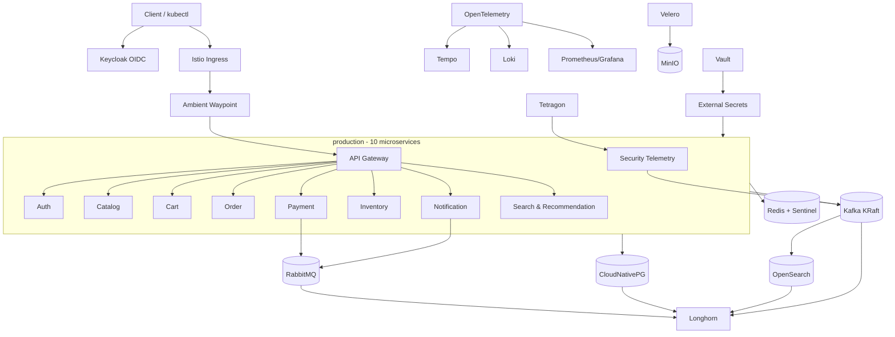

# BÁO CÁO TRIỂN KHAI AIMS TRÊN KUBERNETES

**Đơn vị:** HUST  
**Học phần/nhóm:** ISD.20252-18  
**Môi trường:** cụm kubeadm tại mạng `10.1.16.0/24`  
**Namespace ứng dụng:** `production`  
**Ngày chốt báo cáo:** 12/09/2026
**Mã nguồn và Infrastructure as Code:** `Programming/k8s/`

> Báo cáo không ghi mật khẩu, token, private key hoặc giá trị Secret. Các bí mật
> thật được lưu trong Vault và đồng bộ vào Kubernetes qua External Secrets
> Operator.

## 1. Mục tiêu và phạm vi

Dự án triển khai AIMS theo mô hình production-like, ưu tiên tính sẵn sàng cao,
zero-trust, supply-chain security, GitOps, quan sát được và có khả năng phục hồi.
Phạm vi gồm:

- cụm Kubernetes kubeadm HA sử dụng containerd;
- Cilium, Istio Ambient và mTLS STRICT;
- 10 microservice độc lập dưới dạng Argo Rollout;
- PostgreSQL, Redis, Kafka, RabbitMQ, MinIO và Longhorn;
- Vault, External Secrets, cert-manager và Keycloak;
- Kyverno, Gatekeeper, Trivy, Tetragon và Falco;
- Prometheus/Grafana, Loki, Tempo, OpenTelemetry và OpenSearch;
- GitHub Actions CI, Argo CD, Argo Rollouts, Syft, Cosign và Rekor;
- backup namespace `production` bằng Velero vào MinIO;
- tài liệu vận hành, kiểm tra và xử lý sự cố thực tế.

## 2. Kết quả triển khai

### 2.1 Topology thực tế

Tại thời điểm nghiệm thu, cụm có 3 control-plane và 3 worker:

| Node | IP | Vai trò | Trạng thái |
|---|---:|---|---|
| `k8s-master.local` | `10.1.16.234` | control-plane, etcd | Ready |
| `k8s-master2.local` | `10.1.16.235` | control-plane, etcd | Ready |
| `k8s-master3.local` | `10.1.16.236` | control-plane, etcd | Ready |
| `k8s-worker1.local` | `10.1.16.237` | worker | Ready |
| `k8s-worker3.local` | `10.1.16.239` | worker | Ready |
| `k8s-worker4.local` | `10.1.16.238` | worker | Ready |

Trong quá trình triển khai, topology đã thay đổi nhiều lần. Cấu hình cuối cùng
khôi phục đúng quorum 3 control-plane; địa chỉ `.238` hiện là worker theo yêu cầu.

### 2.2 Trạng thái ứng dụng

- 10 Argo Rollout, mỗi service 2 replica: tổng 20 pod Ready.
- Phân bố workload microservice cuối: `6–7–7`, max skew bằng 1.
- PostgreSQL CNPG: 3/3 instance, một instance trên mỗi worker.
- Kafka KRaft: 3/3 broker/controller, một pod trên mỗi worker.
- RabbitMQ: 3/3, Redis: 3 replica kèm 3 Sentinel.
- MinIO: 2 server, mỗi server 2 volume Longhorn; cả 4 PVC đã mở rộng lên 50 GiB.
- OpenSearch: 3 node với hard anti-affinity.
- Cilium, Tetragon và Falco chạy trên toàn bộ 6 node.
- Velero có BSL `Available`, lịch hằng ngày và các backup thành công trong MinIO.

### 2.3 Kiến trúc tổng thể



## 3. Tầng ứng dụng AIMS

| Service | Trách nhiệm | State chính | Giao tiếp bất đồng bộ | Hardening đặc biệt |
|---|---|---|---|---|
| `api-gateway` | điểm vào API, routing/facade | Redis | Kafka | seccomp RuntimeDefault |
| `auth-service` | đăng nhập, quyền, tích hợp OIDC | PostgreSQL | Kafka audit | mTLS + drop ALL |
| `catalog-service` | sản phẩm, media metadata | PostgreSQL | Kafka business | read-only theo lộ trình |
| `cart-service` | giỏ hàng | Redis/PostgreSQL | Kafka | cache + mTLS |
| `order-service` | vòng đời đơn hàng | PostgreSQL | Kafka business | canary |
| `payment-service` | điều phối thanh toán | PostgreSQL | RabbitMQ ack/DLQ + Kafka | runc + seccomp |
| `inventory-service` | tồn kho/reservation | PostgreSQL | Kafka | idempotency cần bảo đảm |
| `notification-service` | email/thông báo | PostgreSQL | RabbitMQ ack/DLQ | runc + seccomp |
| `search-recommendation-service` | tìm kiếm/gợi ý | PostgreSQL | Kafka interaction | read-only rootfs |
| `security-telemetry-service` | audit, feature/model anomaly | OpenSearch/Kafka | Kafka security topic | Localhost seccomp + AppArmor |

Mười service có source, dependency, Dockerfile, test và image GHCR pin digest
riêng. Bảy service stateful sở hữu PostgreSQL schema riêng; giao tiếp xuyên
domain dùng HTTP contract, Kafka event versioned, outbox/idempotency và RabbitMQ
task ack/DLQ. Backend Django cũ chỉ còn là artifact tương thích trong pipeline,
không còn là image của 10 Rollout live.

## 4. Cơ sở lý thuyết các công nghệ

### 4.1 Kubernetes, kubeadm và containerd

Kubernetes tổ chức workload theo trạng thái mong muốn. API Server lưu state qua
etcd; Scheduler chọn node; Controller Manager liên tục reconcile; kubelet biến
PodSpec thành container thực tế. `kubeadm` cung cấp quy trình bootstrap cụm
upstream, phù hợp lab/đào tạo vì người vận hành nhìn thấy certificate, static pod
và lifecycle của control-plane. `containerd` là CRI runtime; Kubernetes không cần
Docker daemon.

Ba thành viên etcd cho phép chịu lỗi một thành viên. Với hai thành viên, mất một
node sẽ mất quorum; vì vậy topology cuối dùng ba control-plane.

### 4.2 Cilium, eBPF và Hubble

Cilium thay CNI truyền thống bằng eBPF program trong kernel. Nó thực hiện
networking, identity-aware policy, service load balancing và quan sát flow.
Hubble đọc flow từ Cilium để hiển thị source, destination, verdict và L7 metadata.

NetworkPolicy là default-deny/allow ở L3-L4; CiliumNetworkPolicy mở rộng DNS/FQDN
và L7. Khi kết hợp Istio Ambient, cần cho phép cổng HBONE `15008`, nếu không
ztunnel đã mã hóa nhưng packet vẫn bị Cilium drop trước khi đến workload.

### 4.3 Istio Ambient Mode

Ambient loại bỏ sidecar khỏi từng pod. `ztunnel` chạy theo node để cung cấp
L4 secure overlay và mTLS; waypoint proxy chỉ được dùng khi cần L7 routing,
authorization hoặc telemetry. Ưu điểm là giảm tài nguyên và tránh lifecycle
sidecar; đánh đổi là phải hiểu đường đi HBONE và identity ở CNI.

`PeerAuthentication STRICT` buộc traffic mesh dùng mTLS. Namespace `production`
được gắn `istio.io/dataplane-mode=ambient` và sử dụng `aims-waypoint`.

### 4.4 PSA, seccomp, AppArmor, capabilities và gVisor

- **Pod Security Admission (PSA):** cơ chế built-in kiểm tra chuẩn privileged,
  baseline, restricted. Namespace `production` hiện Enforce `restricted:latest`;
  bootstrap giữ audit/warn trước, chỉ bật Enforce sau khi frontend và waypoint
  đã tương thích. Namespace `cks-lab` tách riêng dùng Baseline Enforce.
- **seccomp:** lọc syscall. Pod bình thường dùng `RuntimeDefault`; security
  telemetry dùng Localhost profile `profiles/aims-runtime.json`.
- **AppArmor:** Mandatory Access Control theo path/capability; profile
  `aims-restricted` được cài trên cả ba worker.
- **Linux capabilities:** container bỏ toàn bộ `ALL`, không dùng privileged và
  tắt privilege escalation.
- **gVisor:** RuntimeClass `sandbox` dùng `runsc`, tạo kernel boundary ở user
  space cho payment và notification. Nó an toàn hơn runc nhưng có overhead.

### 4.5 CloudNativePG và Redis Operator

CloudNativePG quản lý bootstrap, replication, failover, switchover, certificate
và backup semantics của PostgreSQL. Ba instance được anti-affinity theo hostname.
Trong sự cố DiskPressure, CNPG tự failover primary và phục hồi replica.

Redis phù hợp cache/session/temporary state, không thay PostgreSQL cho dữ liệu
giao dịch. Redis Replication + Sentinel cung cấp primary discovery và failover;
password lấy từ Vault.

### 4.6 Kafka và RabbitMQ

Kafka là distributed append-only event log, phù hợp business event và security
telemetry cần replay/retention. RabbitMQ là message broker/task queue, phù hợp
payment/notification cần acknowledgement, retry, routing và DLQ. Hai công nghệ
không trùng mục tiêu. Chi tiết Kafka nằm trong
`AIMS_KAFKA_DEPLOYMENT_REPORT.md`.

### 4.7 Longhorn và MinIO

Longhorn cung cấp CSI block storage, replica dữ liệu, snapshot và volume attach
giữa các worker. `replica-count=2` là thỏa hiệp phù hợp lab ba worker, nhưng không
thay backup ngoài cluster.

MinIO cung cấp S3-compatible object storage. Nó lưu bucket Velero; application
cũng có thể dùng cho ảnh/tệp. MinIO tenant dùng bốn PVC (2 server × 2 volume).

### 4.8 Vault, External Secrets và cert-manager

Vault là nguồn sự thật của secret/PKI. Kubernetes auth cho phép ESO lấy secret
theo ServiceAccount thay vì lưu token Vault dài hạn. ExternalSecret reconcile
giá trị sang Secret đúng namespace. cert-manager tự động hóa Certificate,
Issuer/ClusterIssuer và rotation TLS.

### 4.9 Keycloak và OIDC

Keycloak là Identity Provider hỗ trợ OAuth 2.0/OIDC. Application nhận ID/access
token; Kubernetes API Server có thể tin issuer và map claim thành username/group.
Realm/client phải có TLS, redirect URI hẹp và client secret nằm trong Vault.
Không nên dùng admin mặc định/start-dev cho môi trường thật.

### 4.10 Kyverno và OPA Gatekeeper

Kyverno viết policy bằng YAML gần với Kubernetes object, phù hợp enforce production.
Gatekeeper dùng Rego, hữu ích để luyện CKS và biểu diễn policy tổng quát. Thiết kế
ở đây dùng Kyverno `Enforce`; Gatekeeper đã chuyển sang `deny` sau khi audit có
0 violation. Cosign/SLSA là policy Audit riêng do image lab chưa ký.

### 4.11 Supply-chain security theo SLSA v1.2

Pipeline có các lớp:

1. test backend/frontend;
2. build và push image theo commit SHA;
3. Trivy chặn CRITICAL vulnerability và misconfiguration;
4. kubesec scan PodSpec đã render từ Helm;
5. Syft tạo CycloneDX SBOM;
6. job tạo SLSA provenance v1, có source commit, builder/run và digest SBOM;
7. Cosign keyless ký image theo digest, attach CycloneDX + SLSA in-toto
   attestations bằng GitLab OIDC; Rekor lưu transparency entry;
8. Cosign tự verify cả chữ ký lẫn hai predicate;
9. GitOps commit cập nhật image digest immutable.

Ký image không đồng nghĩa image an toàn; signature chứng minh provenance, còn
Trivy/SBOM/policy quyết định có được phép deploy hay không.

Kyverno `aims-verify-signed-slsa-images` xác minh issuer/SAN GitLab, Rekor,
digest, SLSA predicate và CycloneDX tại admission. Policy ban đầu là `Audit` với
`mutateDigest=false`, `verifyDigest=true` để image lab local không làm gián đoạn
cụm; sau pipeline registry đầu tiên phải đổi sang `Enforce` và bật mutation.
Thiết kế cung cấp SLSA-compatible Build L1 evidence, chưa tuyên
bố L2/L3 vì provenance còn do job tenant tạo thay vì control plane builder độc
lập/hardened.

### 4.12 GitOps và progressive delivery

GitLab CI tạo artifact; Argo CD pull desired state từ Git; Argo Rollouts thay
Deployment bằng canary. Chiến lược AIMS: 20% → pause 30 giây → 50% → pause 30
giây → 100%, `maxUnavailable=0`. Argo CD không nên nhận credential cluster để
push trực tiếp; mô hình pull giảm blast radius.

### 4.13 Observability và runtime security

- Prometheus lưu metric time-series; Grafana hiển thị dashboard/alert.
- Loki lưu log; Tempo lưu distributed trace.
- OpenTelemetry chuẩn hóa receiver, processor và exporter.
- OpenSearch lưu/tìm kiếm security event và phục vụ analytics.
- Tetragon quan sát process/file/network bằng eBPF và có enforcement khả dụng.
- Falco phát hiện runtime rule theo syscall, giữ lại để luyện CKS và so sánh.

### 4.14 Velero và DR

Velero backup Kubernetes object và dữ liệu volume qua node-agent/file-system
backup. Backup được gửi tới bucket MinIO. Snapshot Longhorn giúp phục hồi nhanh
trong cluster nhưng không bảo vệ khỏi mất toàn cụm; Velero + object storage là
lớp DR khác.

## 5. Triển khai thực hành

### 5.1 Cấu trúc mã

```text
.
├── .github/workflows/aims-supply-chain.yml
├── contracts/asyncapi/aims-events.yaml
├── services/                     # 10 FastAPI service độc lập
└── Programming/k8s/
    ├── aims-chart/               # 10 Rollout + frontend + HTTP/HTTPS routing
    ├── cks-lab/                  # CKS guardrail + gVisor smoke
    ├── node-profiles/            # seccomp và AppArmor Localhost
    ├── platform/                 # foundation/data/policy/observability/backup
    └── scripts/                  # reconcile/audit/verify/backup/restore
```

`.github/workflows/aims-supply-chain.yml` là pipeline phát hành chính; mỗi service
và frontend/backend tương thích có Dockerfile ngay trong thư mục của mình.

### 5.2 Thứ tự triển khai khuyến nghị

1. kubeadm/control-plane, containerd, Cilium;
2. Longhorn và StorageClass;
3. Istio base/CNI/istiod/ztunnel/gateway;
4. cert-manager, Vault, ESO;
5. operator CNPG/Redis/Strimzi/RabbitMQ/MinIO;
6. data/messaging CR;
7. Kyverno/Gatekeeper/runtime policy;
8. observability và runtime security;
9. Helm chart AIMS + Argo Rollouts;
10. Velero và backup smoke test.

Các lệnh apply chính:

```bash
kubectl apply --server-side --force-conflicts \
  -f Programming/k8s/platform/00-foundation.yaml
kubectl apply --server-side --force-conflicts \
  -f Programming/k8s/platform/10-data-messaging.yaml
kubectl apply -f Programming/k8s/platform/15-external-secrets.yaml
kubectl apply -f Programming/k8s/platform/20-policy-security.yaml
kubectl apply -f Programming/k8s/platform/21-gatekeeper-constraint.yaml
helm upgrade --install aims Programming/k8s/aims-chart -n production
```

### 5.3 Secret bootstrap

Vault HA Raft được initialize/unseal; recovery material chỉ lưu trong Kubernetes
Secret quản trị ở namespace Vault và phải được sao lưu mã hóa ngoài cluster.
KV v2 path logic là `aims/production`; ESO dùng Kubernetes auth role giới hạn.

Không đưa `.env`, Vault root token, MinIO root password hoặc Keycloak secret vào
Git. Kiểm tra sync mà không in giá trị:

```bash
kubectl get clustersecretstore vault
kubectl get externalsecret -A
kubectl -n production get secret aims-runtime -o jsonpath='{.metadata.name}'
```

### 5.4 Migration PostgreSQL legacy sang CNPG

Quy trình đã thực hiện:

1. scale 9 Rollout và backend legacy xuống 0 trong maintenance window;
2. tạo dump ở `/home/dat/aims-deploy-20260729/backups/`;
3. restore bằng `pg_restore --role=aims` vào CNPG;
4. đối chiếu 97 bảng và 30 Django migration;
5. đổi `DATABASE_URL` trong Vault sang service `aims-postgres-cnpg-rw`;
6. chờ ESO sync, scale lại 9 Rollout;
7. kiểm tra Django query trả `db=aims` và health HTTP 200.

PostgreSQL legacy được giữ tạm thời để rollback, không còn nhận traffic.

### 5.5 Messaging

- Kafka cluster `aims-kafka`, 3 dual-role broker/controller, KRaft.
- Topic `aims-business-events`: 6 partition, RF=3, min ISR=2.
- Topic `aims-security-telemetry`: 6 partition, RF=3, min ISR=2.
- KafkaUser `aims-services`: TLS + simple ACL theo prefix `aims-`.
- RabbitMQ 3 replica; queue payment/notification durable, có DLX/DLQ routing.

### 5.6 Network và mesh

Namespace `production` chạy Ambient. PeerAuthentication là STRICT. Cilium policy
chọn workload có label `app.kubernetes.io/part-of=aims`; ingress HBONE từ
`host`/`remote-node` qua TCP 15008 được cho phép. DNS 53, Keycloak,
observability và egress 80/443 được khai báo rõ.

### 5.7 Runtime hardening

Pod AIMS:

```yaml
securityContext:
  runAsNonRoot: true
  seccompProfile:
    type: RuntimeDefault
containers:
  securityContext:
    allowPrivilegeEscalation: false
    capabilities: { drop: ["ALL"] }
```

Payment/notification thêm `runtimeClassName: sandbox`; security telemetry dùng
Localhost seccomp và AppArmor. Profile được cài bằng
`scripts/install-node-profiles.sh` trên cả ba worker.

### 5.8 Cân bằng workload

Chart gắn label `aims.hust.vn/workload-group=microservices`, topology spread theo
hostname và anti-affinity ưu tiên cho hai replica cùng service. Sau khi topology
node thay đổi, image local và profile được đồng bộ sang worker mới, rồi workload
được tái cân bằng an toàn từng pod. Kết quả cuối là 6–6–6.

Stateful workload 3 replica dùng hard anti-affinity khi operator/chart hỗ trợ:
CNPG, Kafka, RabbitMQ và OpenSearch trải một pod mỗi worker.

### 5.9 Observability

OpenTelemetry Collector nhận OTLP gRPC/HTTP, thêm
`deployment.environment=production`, batch rồi export:

- traces → Tempo;
- logs → Loki;
- metrics → Prometheus exporter;
- debug exporter phục vụ kiểm tra lab.

OpenSearch chạy 3 master/data/ingest node, 10 GiB Longhorn/node. Password admin
được cấp từ Vault. Demo certificate của chart cần được thay bằng certificate
cert-manager trước khi public endpoint.

### 5.10 Backup và restore

Velero BSL dùng S3 path-style tới MinIO. Node-agent chạy trên ba worker. Lịch:

```yaml
schedule: "0 2 * * *"
includedNamespaces: [production]
ttl: 720h
```

Smoke backup đã hoàn tất 4.069/4.069 object, 0 warning, 0 error. Các backup daily
ngày 30/07, 31/07 và 01/08 đã xuất hiện trong BSL.

Recovery point cuối sau đợt reconcile là
`production-post-cks-20260801`: `Completed`, 1.102/1.102 item, 0 error và 6
warning; BSL `default=Available`.

Kiểm tra:

```bash
kubectl -n velero get backupstoragelocations.velero.io
kubectl -n velero get backups.velero.io
kubectl -n velero describe backup <name>
```

Restore drill metadata đã được chạy bằng runbook có guardrail:

```bash
Programming/k8s/scripts/velero-config-restore-drill.sh
kubectl -n velero get restores.velero.io \
  -l restore.aims.io/type=configmap-drill
```

Restore `aims-config-drill-20260801113325` từ
`production-post-cks-20260801` có phase `Completed`, phục hồi 11 ConfigMap vào
`production-drill`, đồng thời xác minh 0 Pod, 0 Secret, 0 PVC và 0 controller.
Namespace tạm sau đó được xóa, Restore CR giữ lại làm bằng chứng. Drill này chỉ
chứng minh đường phục hồi metadata; PostgreSQL/Kafka/volume cần full-data drill
riêng trước khi cam kết RPO/RTO.

Tại thời điểm chụp nghiệm thu, một Sentinel validation run bên ngoài AIMS đang
giữ deletion lock cho bốn controller nginx/Redis/load-generator trong
`production`. Tất cả đều Running/Ready; verifier báo riêng là `INFO`, không coi
chúng là desired-state. Cleanup sẽ xử lý ngay khi binding lock được gỡ.

## 6. Sự cố đã gặp và cách xử lý

### 6.1 DiskPressure và mở rộng filesystem sáu node

Kubelet mặc định bắt đầu imagefs eviction ở mức trống 15%, làm partition 40 GiB
bị taint dù còn gần 6 GiB. Sau khi hypervisor tăng `/dev/sda` lên 300 GiB,
`growpart /dev/sda 2` và `resize2fs /dev/sda2` được chạy online trên sáu node.
Root filesystem hiện khoảng 295 GiB/node; control-plane dùng 9–12%, worker dùng
13–20%, cả sáu node `DiskPressure=False`. Eviction threshold được trả về 10% và
tiếp tục được giám sát bằng `node_filesystem_avail_bytes`.

### 6.2 CNPG failover

Một primary bị eviction do ephemeral-storage. CNPG bầu primary mới, ứng dụng vẫn
phục vụ, sau đó replica được rebuild. Đây là kiểm thử failover thực tế; cuối cùng
cluster trở lại 3/3.

### 6.3 Lỗi filesystem sau thay topology

Ba PVC CNPG/MinIO/OpenSearch báo `fsck found errors but could not correct` sau
volume reattach. Quy trình an toàn:

1. tạo Longhorn snapshot `pre-fsck-*` và chờ `readyToUse=true`;
2. xác minh block device không mount;
3. chạy `e2fsck -fy`;
4. xác minh lại và để CSI attach;
5. kiểm tra health ở tầng database/object/search.

MinIO volume có inode/filetype hỏng được đưa về trạng thái mount được; CNPG và
OpenSearch phục hồi đầy đủ.

### 6.4 Kafka broker permission

Broker 2 lỗi `AccessDeniedException` tại `kafka-log2` sau node/PVC chuyển chỗ.
Snapshot Kafka được tạo trước sửa. Broker được recreate sau khi worker profile,
filesystem và UID/GID phù hợp; cluster trở lại Ready 3/3. Chi tiết ở báo cáo Kafka.

### 6.5 Istio Ambient và Strimzi

NetworkPolicy do Strimzi sinh ra từng chặn HBONE 15008. Policy bổ sung cho phép
Ambient traffic nhưng vẫn giữ mTLS STRICT. Đây là ví dụ hai lớp security có thể
vô tình chặn nhau nếu chỉ kiểm tra độc lập.

## 7. Bổ sung Gateway API, RBAC, audit và kube-bench

### 7.1 Ingress và waypoint tách vai trò

- `Gateway/istio-ingress/aims-ingress`, class `istio`: north–south ingress;
- `HTTPRoute/production/aims-web`: route theo prefix đến 9 service/frontend;
- `Gateway/production/aims-waypoint`, class `istio-waypoint`: east–west Ambient
  L7; mTLS L4 vẫn do ztunnel đảm nhiệm.

VirtualService cũ được bỏ khỏi Helm chart. Gateway chỉ cho namespace
`production` attach route, tránh route ngoài phạm vi chiếm listener. Istio tự
sinh Deployment/Service `aims-ingress-istio`; HPA giữ 2–4 replica và PDB giữ ít
nhất một replica available. CRD hiện tại chưa khai báo `spec.infrastructure`,
do đó chart không dùng extension `parametersRef` của Gateway API mới hơn. Vì
kubeadm bare metal không có LoadBalancer controller, Gateway mang annotation
`networking.istio.io/service-type: NodePort`; trạng thái `Programmed=True`, HPA
đã tạo 2 replica. HTTP NodePort 31088 và HTTPS NodePort 32725 đều Programmed;
certificate self-signed `aims.lab` do cert-manager quản lý, smoke test TLS trả 200.

### 7.2 RBAC

Nhóm OIDC `aims-developers/aims-observers` chỉ đọc runtime metadata/log, không
đọc Secret. `aims-operators` có `admin` trong riêng namespace production.
ServiceAccount CI/CD chỉ mutate application và routing, không có delete/Secret/
data-plane permission. ServiceAccount ứng dụng không mount token API.

### 7.3 Kubernetes audit logging

Audit policy chỉ log Metadata cho Secret, RequestResponse cho thay đổi RBAC và
admission, Request cho mutation production/hạ tầng, bỏ noisy health/metrics và
giữ catch-all Metadata. Static pod API server được thay rolling từng node, có
backup, health gate và log rotation 100 MiB × 10/tối đa 30 ngày.

### 7.4 kube-bench

kube-bench v0.15.5 chạy dạng hai DaemonSet: target control-plane/etcd/node/policy
trên 3 CP và target node/policy trên 3 worker. Host mount read-only, drop ALL,
seccomp RuntimeDefault, JSON stdout được hệ thống log thu thập.

Lệnh được ghim Kubernetes 1.34/CIS 1.12. Kết quả cuối: mỗi worker 19 PASS/0
FAIL/40 WARN; mỗi control-plane 73 PASS/2 FAIL/51 WARN. Hai control-plane finding
còn lại được chấp nhận: kubeadm static etcd chạy root và kubelet serving cert do
node-local CA ký, nên không ép ownership/CA chỉ để làm đẹp điểm benchmark.

### 7.5 Trivy Operator

Trivy Standalone từng làm các container của một scan Job đa-container tranh
cache và cùng báo `Failed to acquire cache or database lock`. Helm release được
chuyển sang ClientServer với `trivy-server` 1 replica, giới hạn 1 scan Job song
song, timeout 10 phút và TTL 30 giây. Scan đa-container sau sửa hoàn tất 1/1;
operator/server đều Running. Mapping registry `index.docker.io: mirror.gcr.io`
loại lỗi Docker Hub rate-limit; các scan tiếp theo hoàn tất trong 6–13 giây và
không còn pod `Failed/Unknown/Error`. Report được giữ dưới dạng CRD thay vì giữ
pod Completed. Hai image `prod-sim` chỉ tồn tại trong node-local containerd được
exclude khỏi scanner live; bản registry tương ứng vẫn bị Trivy/Syft kiểm tra ở
GitLab CI.

Pod `scan-vulnerabilityreport-7c979ff444-ghcct` không bị treo: scheduler đã gán
pod vào worker1, scan `kube-controller-manager:v1.34.10` hoàn tất và tạo report
lúc 09:39:34Z với 1 Critical/5 High/3 Medium. TTL controller sau đó xóa scan pod
đúng cấu hình 30 giây. Bộ nghiệm thu kiểm tra riêng cả Job fail và pod Pending
quá 2 phút; kết quả cuối đều bằng 0.

## 8. Kiểm thử nghiệm thu

### 8.1 Node và control-plane

```bash
kubectl get nodes -o wide
kubectl get --raw=/readyz?verbose
kubectl -n kube-system get pods -l component=etcd -o wide
```

Tiêu chí: 6/6 Ready, không DiskPressure, 3 etcd member healthy.

### 8.2 Application

```bash
kubectl -n production get rollouts.argoproj.io
kubectl -n argocd get application aims-production
kubectl -n production get pods \
  -l aims.hust.vn/workload-group=microservices -o wide
kubectl -n production get pods \
  -l aims.hust.vn/workload-group=microservices \
  -o jsonpath='{range .items[*]}{.metadata.name}{" source="}{.metadata.annotations.aims\.hust\.vn/source-revision}{"\n"}{end}'
```

Tiêu chí: Argo CD `Synced/Healthy`, 10/10 Rollout `Healthy`, 20/20 pod Ready,
phân bố 6–7–7 (max skew 1).
Frontend do Helm quản lý có 2/2 replica Ready, non-root và rootfs chỉ đọc.

### 8.3 Data/messaging

```bash
kubectl -n production get cluster.postgresql.cnpg.io aims-postgres-cnpg
kubectl -n production get kafka,kafkatopic,kafkauser
kubectl -n production get rabbitmqcluster,queue
kubectl -n production get redisreplication,redissentinel
kubectl -n production get tenant aims-minio
```

### 8.4 Security

```bash
kubectl get clusterpolicy.kyverno.io
kubectl get k8srequiredruntimehardening
kubectl -n production get cnp
kubectl -n production get tracingpolicynamespaced
kubectl -n kube-system get ds cilium tetragon
kubectl -n falco get ds
```

Kiểm tra runtime class/profile:

```bash
kubectl -n production get pod -l app.kubernetes.io/name=payment-service \
  -o jsonpath='{.items[0].spec.runtimeClassName}'
kubectl -n production get pod \
  -l app.kubernetes.io/name=security-telemetry-service \
  -o jsonpath='{.items[0].spec.securityContext.seccompProfile.type}'
```

## 9. Vận hành thường ngày

```bash
# Tổng quan lỗi
kubectl get pods -A --field-selector=status.phase!=Running,status.phase!=Succeeded

# Cilium/Hubble
cilium status --wait
hubble observe --verdict DROPPED --since 10m

# Rollout
kubectl -n production get rollout -w

# CNPG
kubectl -n production get cluster aims-postgres-cnpg -w

# Longhorn
kubectl -n longhorn-system get volumes.longhorn.io

# Velero
kubectl -n velero get backups.velero.io
```

### 9.1 Sửa lỗi Kopia/MinIO ngày 03/08/2026

Kopia maintenance lỗi vì bốn PVC MinIO 10 GiB chạm minimum-free-drive
threshold. Cả bốn PVC ban đầu được resize lên 30 GiB; hai Longhorn expansion
ticket stale trên worker4 được gỡ có chọn lọc rồi volume attach sang worker3 để
filesystem nhận capacity mới. Không volume/object nào bị xóa. Sau erasure heal,
tenant `health=green`, MinIO Operator `Initialized`, BackupRepository `Ready`,
maintenance mới `Succeeded` và BSL `Available`. Ba PodVolumeBackup mồ côi thuộc
backup đã `Failed` được dọn, còn backup metadata lịch sử vẫn được giữ.

Full validation chỉ ra nguyên nhân gốc là backup đệ quy: Velero chọn cả PVC
MinIO và ghi chúng trở lại bucket trên chính MinIO. Backup được hủy, pool được
annotate loại `data0,data1,cfg-vol`, và bốn PVC tăng tiếp lên 50 GiB để Kopia có
headroom prune pack dở dang. Bucket data phải được bảo vệ off-cluster thay vì tự
backup vào chính nó.

Operator values mới chỉ rõ Prometheus CR trong namespace `monitoring`. Verifier
kiểm tra thêm 4/4 PVC 50 GiB, maintenance Kopia thành công, không còn Job lỗi và
không còn PodVolumeBackup `Prepared/InProgress` mồ côi.

### 9.2 Runbook reboot không sạch ngày 11/08/2026

Một Pod có phase `Running` không đồng nghĩa hệ thống khỏe. Sau reboot phải kiểm
tra thêm `containerStatuses[].ready`, replica controller, CR condition, PVC và
Longhorn robustness. Trình tự đã áp dụng trong cụm:

```bash
kubectl get nodes
kubectl get pods -A -o json | jq -r \
  '.items[] | select(.status.phase != "Succeeded") |
   select(.status.phase != "Running" or
          (([.status.containerStatuses[]?.ready] | all) | not)) |
   [.metadata.namespace,.metadata.name,.status.phase] | @tsv'
kubectl get deploy,sts,ds -A
kubectl -n longhorn-system get volumes.longhorn.io
kubectl -n velero get backuprepositories.velero.io,backups.velero.io
```

Chỉ chạy `e2fsck` khi device không mount và kubelet trên node tương ứng đã dừng.
Snapshot/dump phải có trước; stateful replica được dựng lại từng chiếc từ quorum
khỏe. Với operator native TLS/probe không đi qua sidecar, dùng ngoại lệ
`PeerAuthentication` theo đúng port, không hạ mTLS của cả namespace.

### 9.3 Nghiệm thu backup/restore ngày 12/09/2026

Daily backup từng timeout bốn giờ vì Kopia đọc PID RabbitMQ trong PVC Mnesia và
gặp `EIO`. Cấu hình mới đặt `RABBITMQ_PID_FILE=/operator/rabbitmq.pid` trên
emptyDir, đồng thời loại emptyDir cookie/plugin khỏi filesystem backup. Replica
RabbitMQ có block hỏng không giữ queue/message nên PVC của riêng replica đó được
tái tạo; cluster join lại 3/3 Khepri voter trước khi rolling update tiếp tục.

Backup `production-rabbit-fix-20260912135805` đạt `Completed`, 1.158/1.158
object, 32/32 PodVolumeBackup và 0 error. Restore
`aims-config-drill-20260912140426` phục hồi 12 ConfigMap vào namespace cô lập,
không tạo Pod, Secret, PVC hoặc controller và cleanup namespace thành công.

## 10. Rủi ro và việc còn lại

| Mức | Nội dung | Khuyến nghị |
|---|---|---|
| Đã xử lý | filesystem từng chỉ 40 GiB | sáu node đã mở rộng khoảng 295 GiB và không DiskPressure |
| Đã xử lý | image AIMS từng là image local | GHCR digest, Cosign/SLSA/SBOM và Kyverno Enforce |
| Đã xử lý | service từng dùng chung code/image | 10 artifact độc lập, schema/API/event ownership |
| Cao | MinIO trong cùng cluster với nguồn backup | replicate bucket sang máy/cluster khác |
| Trung bình | OpenSearch chart còn demo TLS | cert-manager + custom security config |
| Đã xử lý | PSA Restricted | `production` đã Enforce, negative test bị từ chối |
| Trung bình | Keycloak start-dev/admin bootstrap | external DB, TLS, HA và rotate bootstrap credential |
| Đã xử lý | Argo CD repoURL | trỏ GitHub `tndat-dev/An-Internet-Media-Store`, tự sync từ `main` |
| Trung bình | Rekor/keyless phụ thuộc GitHub OIDC/Internet | giữ artifact/attestation và kế hoạch mirror registry |
| Thấp | Falco và Tetragon trùng một phần tín hiệu | phân vai rule/alert để giảm noise |

## 11. Bộ thực hành CKS

`Programming/k8s/cks-lab/` và `scripts/verify-cks-lab.sh` ánh xạ sáu domain CKS:
Cluster Setup, Cluster Hardening, System Hardening, Microservice Vulnerabilities,
Supply Chain, Monitoring/Logging/Runtime Security. Kiểm tra live cuối cùng PASS
toàn bộ: RBAC không đọc Secret; PSA, Kyverno và Gatekeeper đều chặn đúng negative
test; NetworkPolicy/mTLS/TLS đúng; kube-bench/Tetragon/Falco phủ 6 node và Trivy
có report.

Chi tiết lý thuyết, bài tập và bằng chứng nằm trong
`AIMS_CKS_PRACTICE_REPORT.md`.

## 12. Kết luận

AIMS đã có nền tảng Kubernetes production-like đầy đủ theo defense-in-depth:
network identity, mTLS, admission policy, sandbox runtime, secrets manager,
supply-chain signing, observability, runtime detection và backup. Các lần
failover, DiskPressure, volume fsck và broker permission đã được xử lý bằng quy
trình có snapshot/kiểm chứng, đem lại bằng chứng vận hành thực tế thay vì chỉ có
manifest lý thuyết.

Để chuyển từ production-like sang production thật, các ưu tiên còn lại là backup
off-cluster, tách failure domain PostgreSQL/Longhorn, và harden Keycloak/
OpenSearch TLS. Với phạm vi lab, 10 microservice và chuỗi GitHub Actions → Argo CD
đã đủ để chứng minh kiến trúc và vận hành end-to-end.
