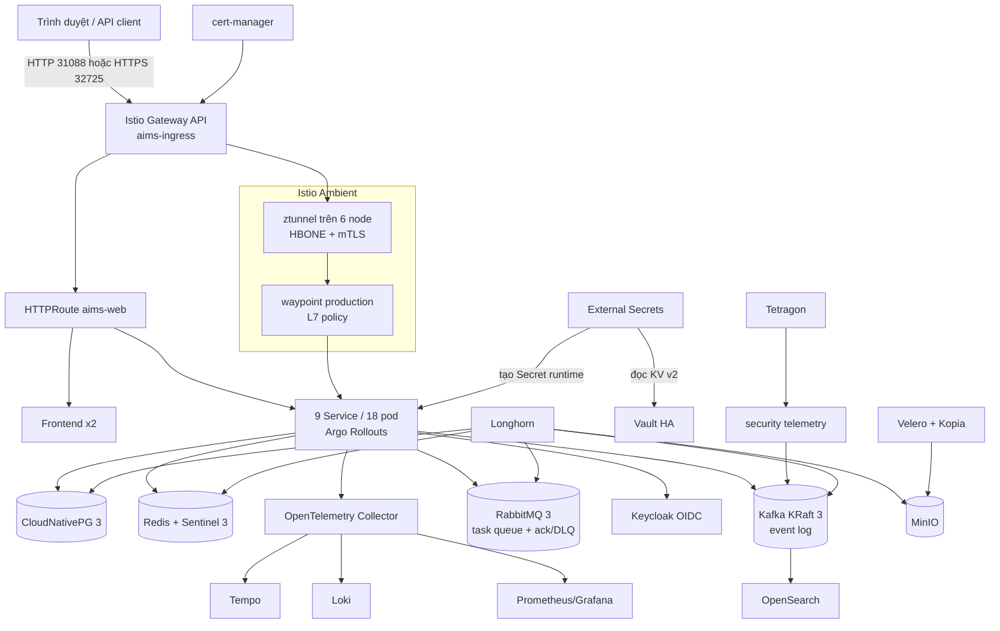
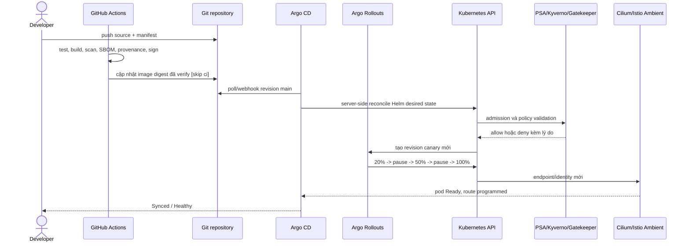
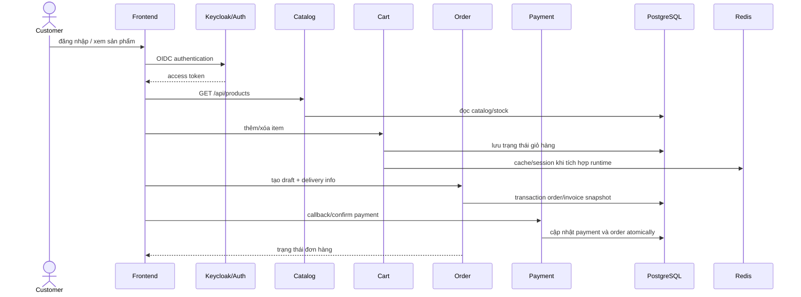
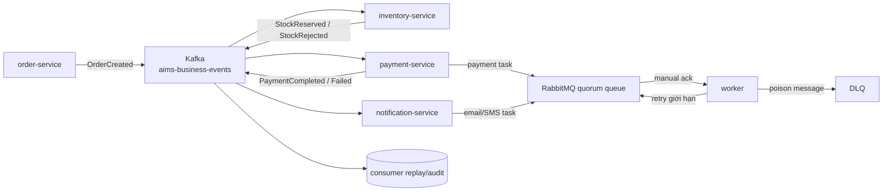
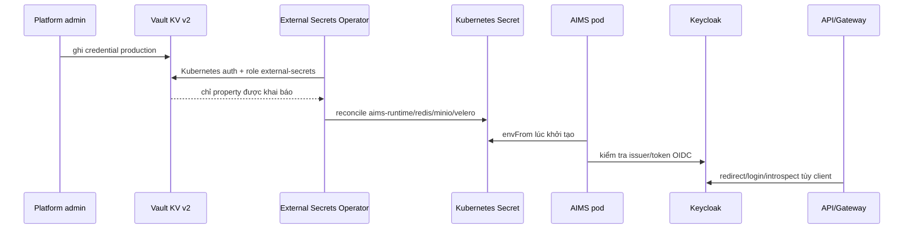
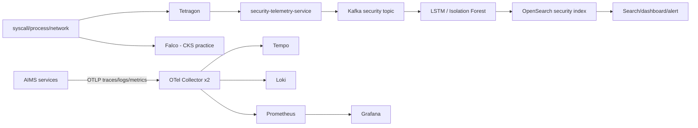
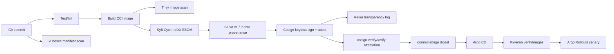
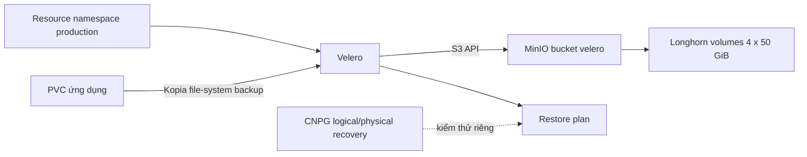

# Báo cáo luồng hoạt động và đồng bộ triển khai AIMS

**Phạm vi:** lab mô phỏng production, namespace `production`

**Cụm nghiệm thu:** kubeadm, 3 control-plane + 3 worker

**Thời điểm chốt trạng thái:** 10/09/2026 (Asia/Bangkok)
**Repository chuẩn:** `tndat-dev/An-Internet-Media-Store`, nhánh `main`

## 1. Mục đích và nguồn sự thật

Tài liệu này mô tả luồng chạy thực tế của AIMS, quan hệ giữa các thành phần và
cách chứng minh source code đã đồng bộ với cụm. Ba lớp trạng thái được phân biệt
rõ:

1. **Git desired state:** Helm chart, manifest, policy, pipeline và runbook trong
   `Programming/k8s` là nguồn sự thật có version.
2. **Argo CD desired/live:** `Application/aims-production` render chart từ Git,
   tự sync, prune và self-heal workload ứng dụng.
3. **Operator-managed live state:** CNPG, Strimzi, RabbitMQ, Redis, MinIO,
   External Secrets, OpenTelemetry và Velero tiếp tục bổ sung default, status và
   resource con. Vì vậy `kubectl diff` có thể thấy metadata/operator default mà
   không phải drift cấu hình.

Repository làm việc duy nhất trên workstation là
`/home/tndat/An-Internet-Media-Store`. Control-plane giữ clone Git đầy đủ tại
`/home/dat/An-Internet-Media-Store` và snapshot K8s dùng cho vận hành tại
`/home/dat/aims-deploy-20260729`. Không dùng workspace HUST làm nguồn deploy.
Sau mỗi lần đồng bộ, `platform/*.yaml`, `cks-lab/*.yaml`, Helm chart và script
trên snapshot phải có checksum giống cùng revision Git.

## 2. Sơ đồ tổng thể



## 3. Luồng reconcile từ Git tới pod



Các resource nền/operator không nên bị Argo CD nhận ownership một cách mơ hồ.
Script `deploy-aims-platform.sh` bootstrap chúng theo thứ tự CRD/operator trước,
custom resource sau. `deploy-aims-resources.sh` chỉ reconcile desired state
AIMS/data/policy khi không muốn nâng cấp chart quan sát lớn.

## 4. Luồng request từ ngoài vào AIMS

### 4.1 Điểm vào

Bare-metal không có cloud LoadBalancer nên Istio-managed Gateway được expose
bằng NodePort:

| Giao thức | Địa chỉ lab | Chức năng |
|---|---|---|
| HTTP | `http://10.1.16.234:31088` | listener 80, host `aims.lab` |
| HTTPS | `https://10.1.16.234:32725` | TLS terminate, certificate self-signed |
| DNS/Host | `aims.lab` | hostname được Certificate và route dùng |

Trên máy client thêm `10.1.16.234 aims.lab` vào `/etc/hosts`, sau đó dùng
`http://aims.lab:31088` hoặc `https://aims.lab:32725`. Với certificate lab,
client cần import CA hoặc dùng `curl -k` khi kiểm thử.

### 4.2 Định tuyến

`HTTPRoute/production/aims-web` gắn vào cả listener HTTP và HTTPS:

| Path prefix | Backend Service |
|---|---|
| `/api/auth/`, `/api/admin/` | `auth-service:8000` |
| `/api/products/` | `catalog-service:8000` |
| `/api/cart/` | `cart-service:8000` |
| `/api/orders/` | `order-service:8000` |
| `/api/payments/` | `payment-service:8000` |
| `/api/inventory/` | `inventory-service:8000` |
| `/api/notifications/` | `notification-service:8000` |
| `/api/security/` | `security-telemetry-service:8000` |
| `/api/` còn lại | `api-gateway:8000` |
| `/` còn lại | `aims-frontend:3000` |

Gateway north-south dùng `GatewayClass/istio`. Waypoint east-west là một
Gateway riêng dùng `GatewayClass/istio-waypoint`; hai khái niệm không được gộp
làm một. Traffic pod-to-Service được ztunnel mã hóa HBONE/mTLS, chuyển qua
waypoint khi cần xử lý L7. `PeerAuthentication/default` giữ STRICT; chỉ port
probe/native TLS đặc thù của operator có ngoại lệ theo port.

### 4.3 Giao diện quản trị giao tiếp giữa các component

Giao diện phù hợp nhất để quan sát service-to-service traffic là **Hubble UI**,
không phải trang web AIMS. Hubble Relay và Hubble UI đang Running; UI trả HTTP
200 từ trong mạng cụm. Service giữ `ClusterIP` để không công khai runtime flow
ra LAN, vì vậy truy cập qua SSH tunnel từ workstation:

```bash
ssh -L 12000:127.0.0.1:12000 dat@10.1.16.234 \
  'kubectl -n kube-system port-forward --address 127.0.0.1 \
  svc/hubble-ui 12000:80'
```

Giữ terminal này mở và truy cập `http://localhost:12000`. Trong Hubble UI, chọn
namespace `production`, sau đó lọc source/destination, verdict
`FORWARDED/DROPPED`, TCP/DNS/HTTP và port. Traffic Ambient có thể xuất hiện dưới
dạng HBONE tới waypoint/ztunnel; cần kết hợp identity, Service và port để phân
biệt flow ứng dụng với flow mesh.

Các giao diện quản trị liên quan đã triển khai:

| Giao diện | Trạng thái/exposure | Địa chỉ hoặc tunnel | Phạm vi quan sát |
|---|---|---|---|
| Hubble UI | Running, `ClusterIP` | `http://localhost:12000` qua tunnel trên | Cilium L3/L4/L7 flow, drop verdict, service map |
| RabbitMQ Management | Running, `ClusterIP` | tunnel local `15672` → `svc/aims-rabbitmq:15672` | connection, channel, exchange, queue, consumer, ack/DLQ |
| Grafana | Running, NodePort | `http://10.1.16.234:32300` | dashboard Prometheus; Explore Loki/Tempo |
| Prometheus | Running, NodePort | `http://10.1.16.234:32090` | target, metric và PromQL |
| Argo CD | Running, NodePort | HTTP `30081`, HTTPS `30443` | Git desired/live và resource tree; không phải network flow |
| Argo Rollouts | Running, NodePort | `http://10.1.16.234:30100` | canary revision và rollout state |
| Keycloak | Running, NodePort | `http://10.1.16.234:30080/auth/` | realm, client, user và OIDC session |
| Vault UI | Running, NodePort | `http://10.1.16.234:30200` | auth method, policy và secret metadata |
| MinIO Console | Running, `ClusterIP` | tunnel local `19090` → `svc/aims-minio-console:9090` | bucket/object/drive health |

Argo CD dùng username mặc định `admin`; password chỉ lấy từ Secret lúc đăng
nhập. HTTPS dùng certificate lab nên trình duyệt có thể cảnh báo:

```bash
ssh dat@10.1.16.234 \
  "kubectl -n argocd get secret argocd-initial-admin-secret \
  -o jsonpath='{.data.password}' | base64 -d; echo"
```

Mở `Application/aims-production` để xem resource tree, revision Git, trạng thái
`Synced/Healthy`, diff và lịch sử reconcile. Argo CD phản ánh quan hệ GitOps,
không thay thế Hubble khi cần xem packet/service flow runtime.

RabbitMQ tunnel:

```bash
ssh -L 15672:127.0.0.1:15672 dat@10.1.16.234 \
  'kubectl -n production port-forward --address 127.0.0.1 \
  svc/aims-rabbitmq 15672:15672'
```

Credential RabbitMQ được đọc tại thời điểm sử dụng, không ghi vào báo cáo/Git:

```bash
ssh dat@10.1.16.234 '
printf "username: "; kubectl -n production get secret \
  aims-rabbitmq-default-user -o jsonpath="{.data.username}" | base64 -d
printf "\npassword: "; kubectl -n production get secret \
  aims-rabbitmq-default-user -o jsonpath="{.data.password}" | base64 -d
printf "\n"'
```

MinIO Console tunnel:

```bash
ssh -L 19090:127.0.0.1:19090 dat@10.1.16.234 \
  'kubectl -n production port-forward --address 127.0.0.1 \
  svc/aims-minio-console 19090:9090'
```

Grafana credential nằm trong Secret `monitoring/monitoring-grafana`; Vault
bootstrap credential nằm trong `vault/vault-bootstrap`; MinIO credential được
ESO reconcile vào `production/aims-minio-env`. Chỉ giải mã tại terminal quản
trị, không copy password/token vào tài liệu hoặc shell history.

Các UI **chưa được cài** gồm Kiali, Kafka UI/AKHQ, OpenSearch Dashboards,
RedisInsight và pgAdmin. Do đó:

- Hubble là UI live network flow hiện có;
- RabbitMQ Management là UI task/message queue hiện có;
- Kafka hiện quản trị bằng Strimzi CR và CLI, chưa có topic/consumer web UI;
- Istio Ambient chưa có Kiali graph riêng; Hubble và Grafana/Tempo là nguồn
  quan sát hiện tại.

## 5. Luồng nghiệp vụ

### 5.1 Luồng mua hàng đồng bộ đang chạy



Source ứng dụng hiện là Django modular monolith. Chín Rollout dùng cùng image
backend nhưng có ServiceAccount, Service, lifecycle, placement và biến
`AIMS_SERVICE_NAME` riêng. Gateway tách path theo domain để mô phỏng biên
microservice và cho phép rollout/policy/telemetry độc lập. Các domain đã có API
trong source là auth, catalog, cart, order và payment; inventory, notification
và security telemetry hiện chủ yếu là topology/integration seam của lab.

Điểm này quan trọng: hạ tầng Kafka/RabbitMQ đã chạy và endpoint đã được inject
vào mọi pod, nhưng source Django hiện chưa có publisher/consumer thực sự dùng
các biến `KAFKA_*` hoặc `RABBITMQ_*`. Vì vậy không tuyên bố giao dịch hiện tại
đã event-driven end-to-end. Luồng mục 5.2 là thiết kế đích có sẵn backbone để
phát triển tiếp, còn luồng mục 5.1 là hành vi ứng dụng đã có trong code.

### 5.2 Luồng event/task đích trên backbone đã triển khai



Kafka giữ business event lâu, có partition/offset và replay; RabbitMQ điều phối
task cần ack, retry và DLQ. Không dùng Kafka thay task queue và không dùng
RabbitMQ làm immutable event log. Strimzi chạy KRaft ba dual-role node, không có
ZooKeeper; topic `aims-business-events` và `aims-security-telemetry` có
replication factor 3.

## 6. Luồng identity, secret và PKI



Secret thật không nằm trong Git. Mỗi backend có ServiceAccount riêng và không
automount token API. RBAC developer chỉ đọc resource vận hành cần thiết, không
được đọc Secret; CI/CD ServiceAccount chỉ có quyền mutation trong phạm vi đã
khai báo. cert-manager cấp certificate self-signed cho `aims.lab`; production
thật phải thay bằng DNS và CA được client tin cậy.

## 7. Luồng security telemetry và quan sát



Tetragon là runtime detector chính của hệ thống; Falco được giữ để luyện luật
CKS và so sánh engine. OpenTelemetry gắn `deployment.environment=production`,
batch và memory limiter trước khi export. Kafka tạo đường đệm/replay cho dữ liệu
security; mô hình LSTM/Isolation Forest của capstone là consumer phân tích đích,
không nằm trong manifest inference hiện tại.

## 8. Luồng supply chain và policy admission



Workflow `.github/workflows/aims-supply-chain.yml` thực hiện
`test → build → scan → SBOM/provenance → sign/attest → verify → GitOps` cho bốn
image. SBOM CycloneDX và SLSA provenance v1 được ký thành in-toto attestation;
Cosign keyless ràng buộc certificate với GitHub Actions OIDC identity và ghi
Rekor. Bản Syft đầy đủ được giữ làm CI artifact, còn predicate CycloneDX rút gọn
giữ component/hash/PURL để không vượt giới hạn context 2 MiB của Kyverno.

Image chạy từ GHCR private bằng digest bất biến. Kyverno admission có RBAC chỉ
được `get` Secret `production/ghcr-pull`, xác minh signature, SLSA và SBOM ở
`Enforce`; `mutateDigest=false` vì GitOps đã pin digest. Cosign 2.6.x tạo legacy
attachments tương thích Kyverno 1.18.2 nhưng vẫn dùng Fulcio/Rekor keyless.

### 8.1 Jenkins CI, Argo CD và service extraction

Jenkins chạy tại namespace `jenkins`, có PVC Longhorn 20 GiB và Kubernetes
ephemeral agent. Controller để `numExecutors: 0`, chỉ tạo agent trong namespace
của Jenkins; controller/agent không có quyền đọc Secret và không có quyền deploy
vào `production`. Pipeline as code là `Jenkinsfile`: test trước, sau đó khi đã
cấp registry/Cosign/GitOps credential ngắn hạn mới bật build/scan/sign và tạo
GitOps change. Argo CD vẫn là thành phần duy nhất reconcile manifest xuống cụm.

`notification-service` là lát cắt đầu tiên tách thật khỏi Django monolith.
Nó có image/source/test riêng, chạy gVisor và consume
`aims.business.payment.completed.v1` bằng group
`aims-notification-service.v1`. TLS client certificate lấy từ KafkaUser
`aims-services`; CA xác minh broker lấy riêng từ
`aims-kafka-cluster-ca-cert`. Native TLS Kafka dùng listener `9093`; Ambient
chỉ mở `PeerAuthentication PERMISSIVE` tại port này, còn Strimzi client TLS và
Kafka ACL vẫn bắt buộc. Event smoke `PaymentCompleted` đã được producer publish
và consumer xử lý thành công.

`inventory-service` là lát cắt độc lập thứ hai: FastAPI + schema PostgreSQL
`inventory_service`, Kafka group `aims.inventory-service.v1`, manual offset
commit, bảng idempotency và transactional outbox. `OrderCreated` dẫn tới
`InventoryReserved` hoặc `InventoryRejected`. Smoke test live chứng minh một
event trừ tồn kho đúng một lần và duplicate cùng `eventId` không tạo side effect
lặp. Bảy Rollout còn lại vẫn là compatibility workload của Django; search &
recommendation là service đích thứ 10 nhưng chưa chạy live.

## 9. Luồng backup và phục hồi



Lịch `production-daily` backup namespace `production`, TTL 720 giờ. PVC MinIO
đích bị loại khỏi Kopia để tránh vòng lặp “backup bucket vào chính bucket”;
object Kubernetes của Tenant vẫn được lưu. Backup nghiệm thu
`production-post-reboot-recovery-20260811` đã `Completed`: 1.730/1.730 object,
43/43 PodVolumeBackup, 0 error và 5 warning vô hại do volume khai báo nhưng
không mount. Restore drill mặc định chỉ phục hồi ConfigMap vào namespace tạm,
không đụng Secret/PVC/workload production.

## 10. Hardening và thực hành CKS

Mỗi pod ứng dụng chạy non-root, read-only root filesystem, drop toàn bộ Linux
capability, cấm privilege escalation và dùng seccomp. Payment/notification dùng
`RuntimeClass/sandbox` (gVisor); security telemetry dùng Localhost seccomp cùng
Localhost AppArmor. PSA `restricted:latest` Enforce cho production. Kyverno và
Gatekeeper chặn cấu hình runtime yếu; Cilium NetworkPolicy và Istio STRICT bảo
vệ network; audit logging ghi mutation/RBAC/policy nhưng không ghi body Secret.

Hai DaemonSet kube-bench bao phủ ba control-plane và ba worker. `cks-lab` tách
khỏi production; verifier chạy negative server-side dry-run để chứng minh PSA,
Kyverno và Gatekeeper từ chối pod vi phạm mà không tạo workload rác.

## 11. Trạng thái live đã nghiệm thu

| Hạng mục | Trạng thái chốt |
|---|---|
| Node | 6/6 Ready, 3 control-plane + 3 worker |
| AIMS | 9/9 Rollout, 18/18 pod backend, 2/2 frontend |
| Phân bố backend | worker1/worker3/worker4 = 6/6/6 |
| CloudNativePG | 3/3, healthy |
| Kafka KRaft | Ready, 3 broker trên ba worker |
| RabbitMQ | 3/3, `AllReplicasReady=True` |
| Redis/Sentinel | 3/3 + 3/3 |
| MinIO | `Initialized`, health `green`, 4 PVC × 50 GiB |
| OpenSearch | 3/3 |
| Vault | 3/3 Ready và unsealed |
| Istio Ambient | ztunnel 6/6, waypoint Ready, mTLS STRICT |
| Longhorn | 29/29 volume healthy, gồm PVC Jenkins |
| Jenkins | controller Ready, PVC Bound, chỉ có quyền tạo agent Pod trong `jenkins` |
| Argo CD | `Synced/Healthy`, GitOps revision được audit trước mỗi lần nghiệm thu |
| Source runtime | 14 Django compatibility pod + 2 notification + 2 inventory độc lập + 2 frontend |
| Pod/Job/PVC | 0 pod lỗi hiện tại, 0 Job failed hiện tại, 0 PVC unbound |
| Gateway | HTTP và HTTPS được verifier sample lặp, đều HTTP 200 |

## 12. Quy trình đồng bộ và kiểm chứng

### 12.1 Đồng bộ clone và snapshot triển khai trên master

Clone Git đầy đủ nằm ở `/home/dat/An-Internet-Media-Store`; cập nhật bằng fast
forward để giữ nguyên lịch sử:

```bash
ssh dat@10.1.16.234 \
  'git -C /home/dat/An-Internet-Media-Store pull --ff-only origin main'
```

Snapshot vận hành chỉ chứa nội dung `Programming/k8s`, không chứa `.git`,
credential hay file môi trường:

```bash
rsync -a --delete \
  Programming/k8s/ \
  dat@10.1.16.234:/home/dat/aims-deploy-20260729/
```

Release hiện tại không còn phụ thuộc tag node-local `prod-sim`. GitHub Actions
build từ source sạch, quét/ký/attest image, ghi immutable GHCR digest và
`sourceRevision` vào Helm values; Argo CD tạo revision pod mới từ commit GitOps.
Do đó manifest, digest và source revision có thể đối chiếu trực tiếp trong audit.

Trong lần bàn giao này, checksum được đối chiếu cho toàn bộ manifest/script sau
khi copy. Báo cáo, source ứng dụng và pipeline nằm trong clone Git đầy đủ;
snapshot K8s chỉ phục vụ reconcile/audit trên control-plane.

### 12.2 Audit read-only trên control-plane

```bash
cd /home/dat/aims-deploy-20260729
EXPECTED_REVISION="$(kubectl -n argocd get application aims-production \
  -o jsonpath='{.status.sync.revision}')" \
EXPECTED_SOURCE_REVISION=78291a9ae9156a2499cad1d9de81f5320eca17cf \
EXPECTED_NOTIFICATION_SOURCE_REVISION=3e6dbc8b5397528fa6d2e86d8e54f5dd5e0ade9f \
  scripts/audit-live-sync.sh
```

Script kiểm tra node Ready/DiskPressure, mọi pod/container, Job hiện đang fail,
PVC, Argo sync/health/revision, chín Rollout, các operator stateful, Longhorn và
chạy tiếp hai verifier AIMS/CKS. Để xem diff server-side mà không apply:

```bash
SHOW_KUBECTL_DIFF=true FULL_VERIFY=false scripts/audit-live-sync.sh
```

Exit 1 của `kubectl diff` chỉ có nghĩa có khác biệt. Với CR do operator quản lý,
phải đọc diff trước khi apply: `last-applied-configuration`, status/default,
immutable volume template hay Job bootstrap đã TTL cleanup không phải lúc nào
cũng là drift. Exit lớn hơn 1 mới là lỗi gọi API trong audit.

### 12.3 Điều kiện hoàn thành

Một lần đồng bộ chỉ được coi là hoàn thành khi đồng thời thỏa mãn:

- Git working tree sạch và commit đã push;
- snapshot master có checksum giống `Programming/k8s` của commit đó;
- Argo CD báo đúng revision, `Synced` và `Healthy`;
- `audit-live-sync.sh`, `verify-aims.sh`, `verify-cks-lab.sh` đều exit 0;
- không còn pod non-ready/Unknown, Job đang failed hoặc PVC unbound;
- HTTP/HTTPS đều trả 200 qua Gateway, không chỉ nhìn condition `Programmed`.

## 13. Giới hạn có chủ đích của lab

- Đây là production-like lab, không phải SLA enterprise; certificate ingress
  self-signed và MinIO backup cùng failure domain với cluster.
- Keycloak đã phục vụ OIDC ứng dụng, nhưng kube-apiserver chưa hoàn tất OIDC cho
  `kubectl`.
- GitLab Runner/Registry/OIDC thật không chạy trong cụm; pipeline đã có code
  nhưng cần import/mirror repository và cấp masked credential để chạy end-to-end.
- Mới `notification-service` là codebase/image độc lập; 8 domain còn lại đang
  compatibility mode và phải chuyển dần qua database ownership, outbox và
  contract Kafka, không copy Django image rồi đổi tên workload.
- SLSA provenance tự sinh trong job chỉ được tuyên bố tương thích Build L1;
  mức L2/L3 cần builder độc lập/hardened sinh provenance.
- Backup MinIO cần replication/off-cluster nếu muốn chống mất toàn cụm.

Các giới hạn này không làm sai mục tiêu học tập: cụm hiện chứng minh đầy đủ
orchestration, operator, HA, policy, supply-chain wiring, runtime security,
observability, backup/restore và quy trình phát hiện/khôi phục lỗi.
